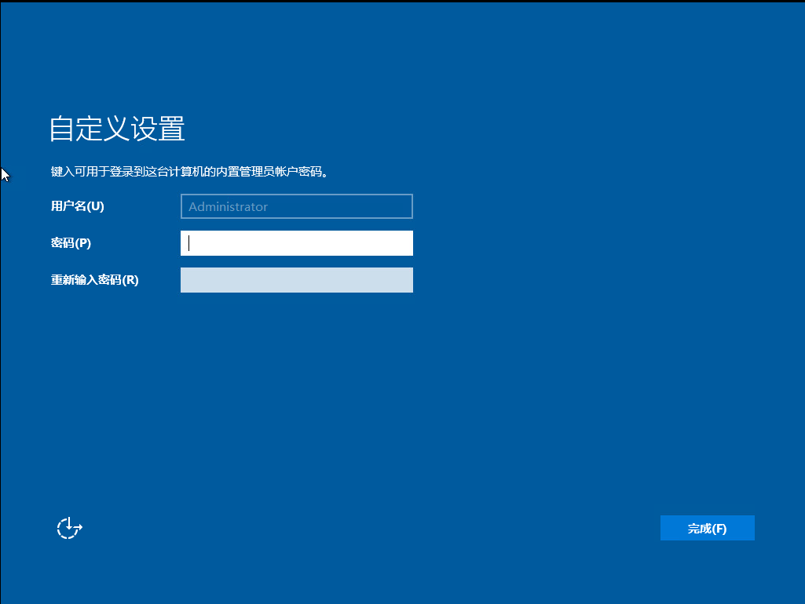
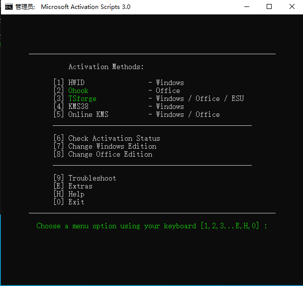
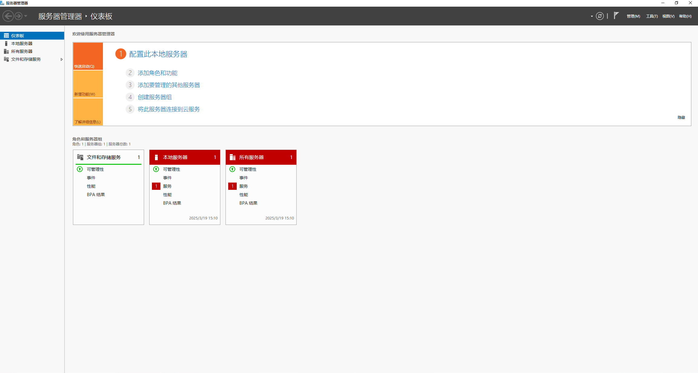

配置Windows AD

<!-- truncate -->

## 配置Windows Server 2022

按照正常流程配置Windows Server的基础配置

### 1.配置管理员密码



### 2.安装Vmware Tool

由于这台Windows由VMware EXSI管理，因此需要安装VmwareTools

按照Vmware Workstation安装流程即可

### 3.配置网络和激活

网络配置完成后，打开 `powershell`输入

```powershell
irm massgrave.dev/get | iex
```

进入MAS3.0界面



选择3，1自动激活

### 4.修改计算机名

在 `运行`对话框中，输入 `sysdm.cpl`

单击“更改”，在“计算机名”中填入规划的计算机名；单击“确定”

根据界面提示完成配置，重新启动计算机后使用Administrator帐号登录。

### 5.**添加AD角色与备份功能**

打开 `服务器管理器`窗口，如下图



点击添加角色和功能

在“角色”对话框中，勾选“Active Directory 域服务”、“DHCP服务器”、“DNS服务器”，在弹出的对话框中单击“添加功能”，单击“下一步”。

在“功能”对话框中，勾选“Windows Server Backup”，
