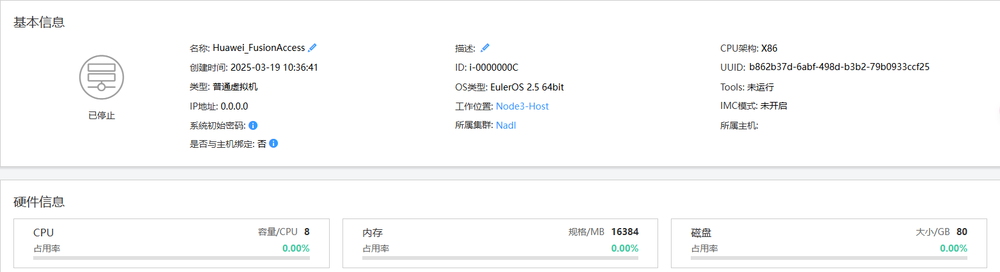
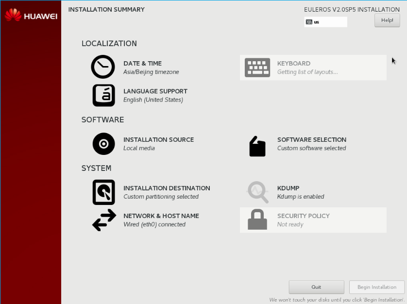
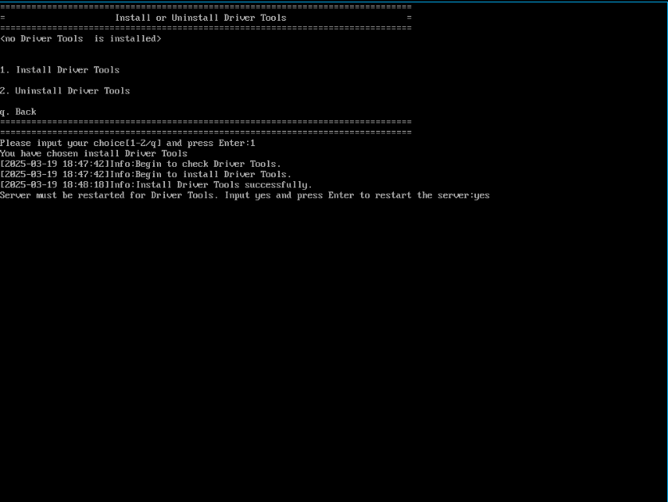
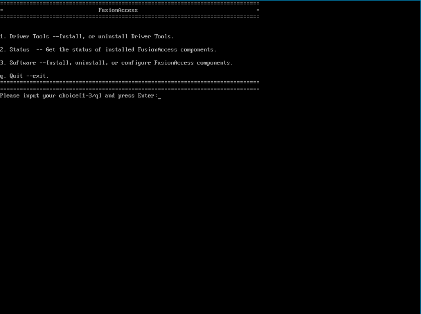
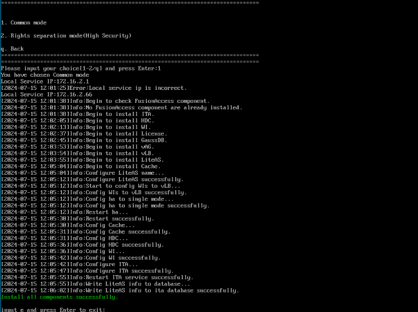
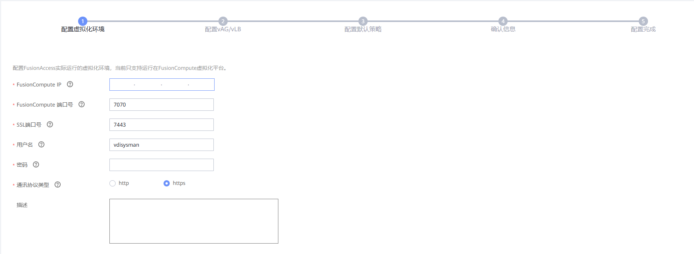
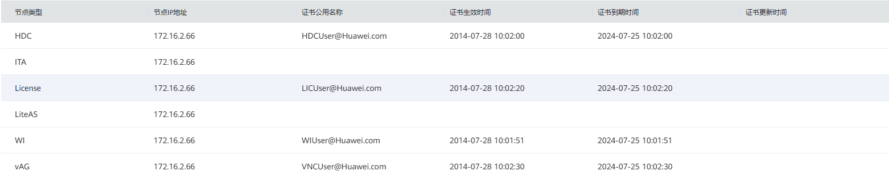
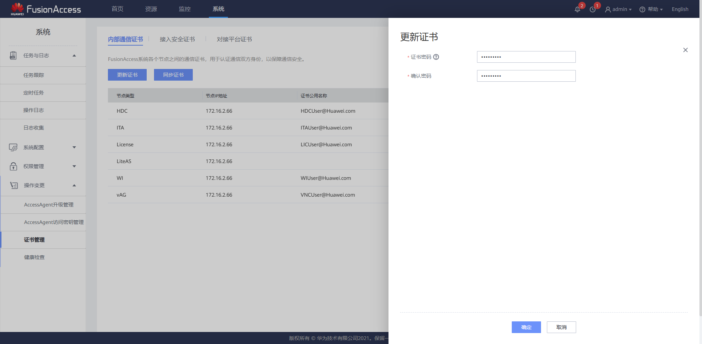
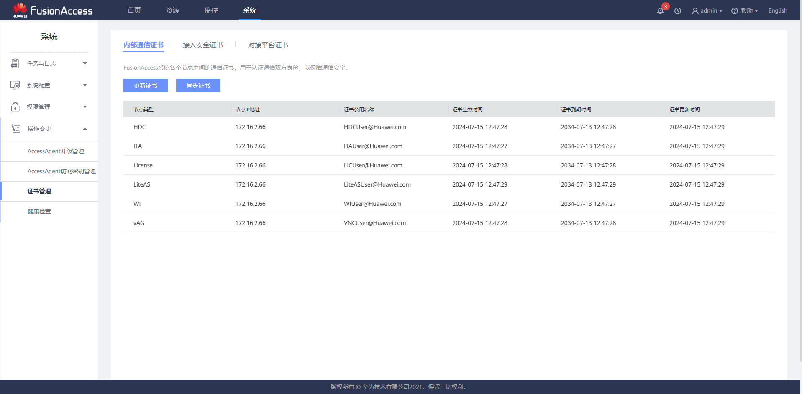

华为 Fusion Access 云桌面部署

<!-- truncate -->

## 环境介绍

宿主机：Huawei FusionComputer CNA-2

## 安装系统

在Fusion Compute中创建一个新的虚拟机，命名为 `Huawei FusionAccess`，配置最低8核16G内存，建议存储不低于80GB。



挂载 `FusionAccess_Manager_Installer_8.0.2-x86_64.iso`，重启虚拟机。

虚拟机重启成功后，请在60秒内选择 `install EulerOS V2.0SPx`，按Enter。安装是自动进行的，全程不需要干涉。



## 配置系统

安装完成后，在FusionCompute界面，基础架构模板虚拟机“概要”页签上方，依次选择“操作 > Tools > 挂载Tools”，单击“确定”。

通过VNC使用root帐号（默认密码为：`Cloud12#$`）登录虚拟机。

根据数据规划配置基础架构虚拟机模板IP地址、子网掩码和网关，按“Enter”。

在FusionAccess配置界面输入数字“1”选择“Driver Tools”，按“Enter”。


输入数字“1”选择“Install Driver Tools”，按Enter，开始安装Driver Tools。

安装完成，输入“yes”，按Enter，重启虚拟机。



虚拟机重启成功之后，通过VNC使用root帐号（默认密码为：`Cloud12#$`）登录虚拟机。

执行以下命令，清除 `/etc/udev/rules.d`目录下的网络设备命名规则。|

```bash
rm -f /etc/udev/rules.d/*-persistent-net.rules
```

## 部署组件

> 这里要注意一个问题，不然一定部署失败
>
> 通告：[【CLD-P-A-202337】关于FusionAccess产品证书过期影响登录桌面的预警通知](https://support.huawei.com/enterprise/zh/bulletins-product/ENEWS2000020185)
>
> 简单来说 Fusion Access 的内部通信证书安装时是写死的，从2014年7月28日到2024年7月25日，内部组件使用该证书进行通信，过期后自然无法通信
>
> 处理方案：[手动更新组件间通讯证书](https://support.huawei.com/hedex/hdx.do?docid=EDOC1100184801&id=ZH-CN_TOPIC_0320043134)
>
> 这里我先使用简单的方法，修改服务器时间到2024年7月25日前
>
> 安装成功后，按照[一键更新组件间通讯证书](https://support.huawei.com/hedex/hdx.do?docid=EDOC1100184801&id=ZH-CN_TOPIC_0320043133)修复

```bash
timedatactl set-time "2024-7-15 12:00:00"
```

通过VNC方式，使用root帐号（默认密码为：`Cloud12#$`）登录虚拟机。

输入 `startTools`，按回车确认。

弹出“FusionAccess”界面。（如果root帐号是前两次登录虚拟机，系统会直接进入“FusionAccess”界面。）
输入“3”选择“Software”，按“Enter”。



输入“1”选择“All In One”，按“Enter”。

输入“1”选择“Create a new node”，按“Enter”。

输入“1”选择“Common mode”，按“Enter”。

输入“Local Service IP”，为本服务器的业务平面IP地址，按“Enter”。

系统开始安装并配置组件。

当显示Install all components successfully.时，表示安装成功。



## 部署FusionAccess

配置虚拟化环境：

输入FusionCompute IP和vdisysman密码



配置vAG/vLB设置

后面全部下一步就行

配置完成后进入dashboard，等待中间的服务状态都变成绿色图标，预计需要20分钟左右

### 证书更新

1. 登录ITA，导航到系统-操作变更-证书管理
   可见证书有效期都是到2024年7月25日
2. 点击更新证书，随后输入证书密码，该密码仅用于保护内部通信证书
3. 更新成功后可见日期已更新

   
