【Horizon】第4章-搭建SQL

<!-- truncate -->

配置一个专用SQL数据库服务器 `MW SQL Server`

## 加入AD域管理

在 `MW SQL Server`上配置Nadl主AD的DNS

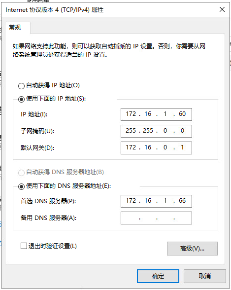

检测 `MW SQL Server`能不能访问域名 `nadl.local`


这里可以访问，继续下一步

计算机名/域更改

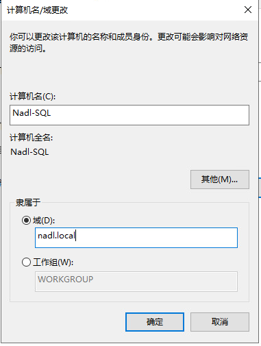

填写AD主域的账号和密码

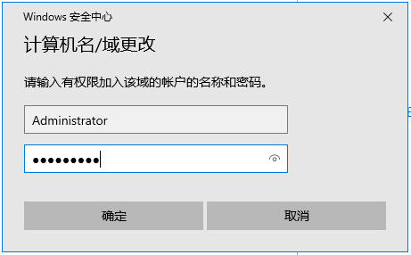

在Nadl-MWS1上验证是否加入域

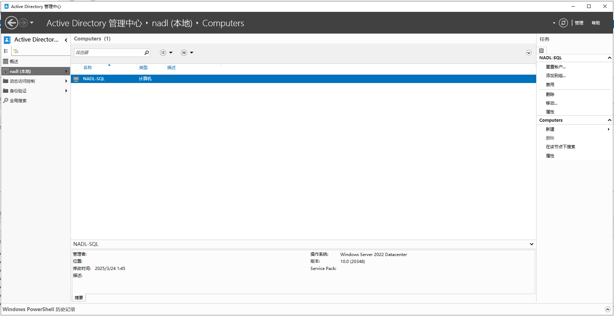

## 安装SQL

进入SQL Server安装页面

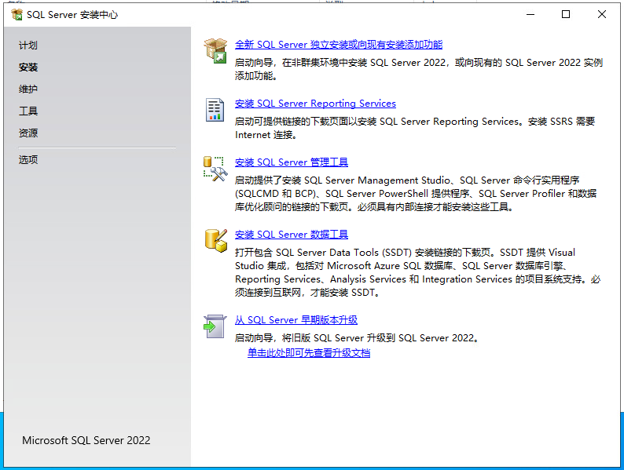

输入密钥

```
J4V48-P8MM4-9N3J9-HD97X-DYMRM
```

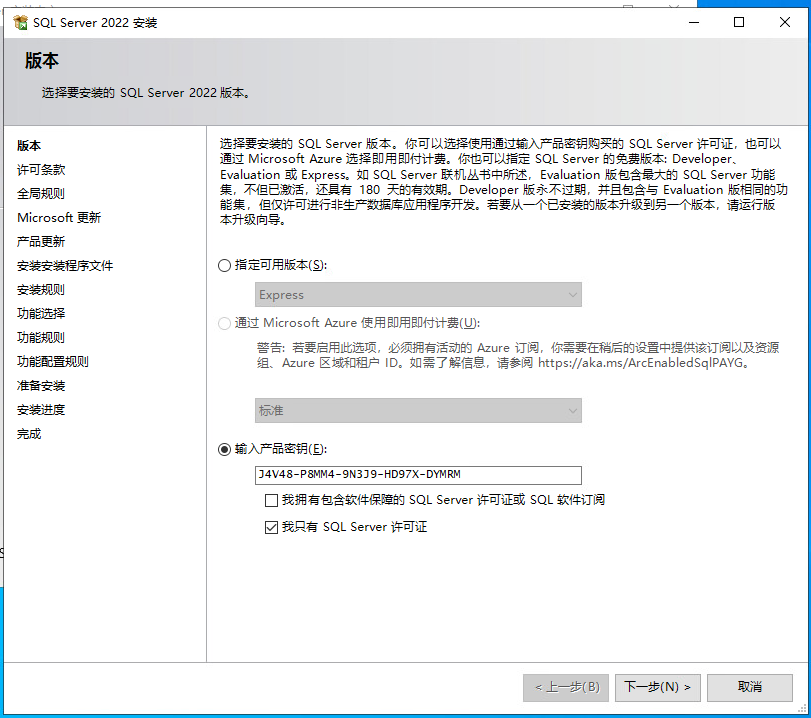

接受许可条款

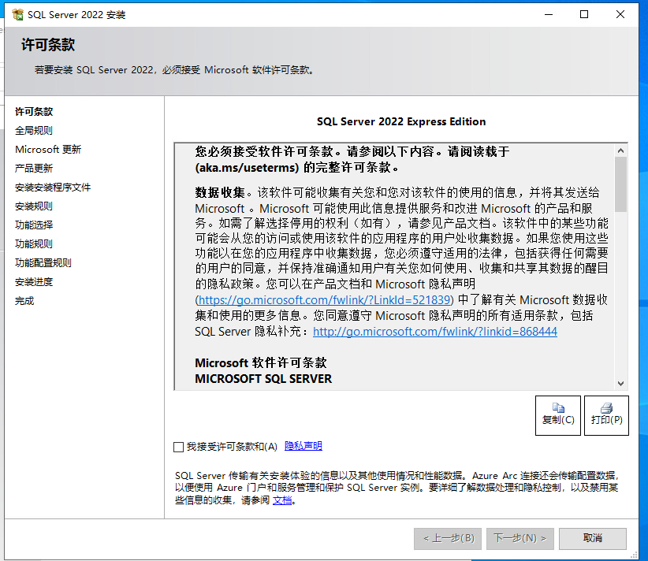

这里不勾选检查更新

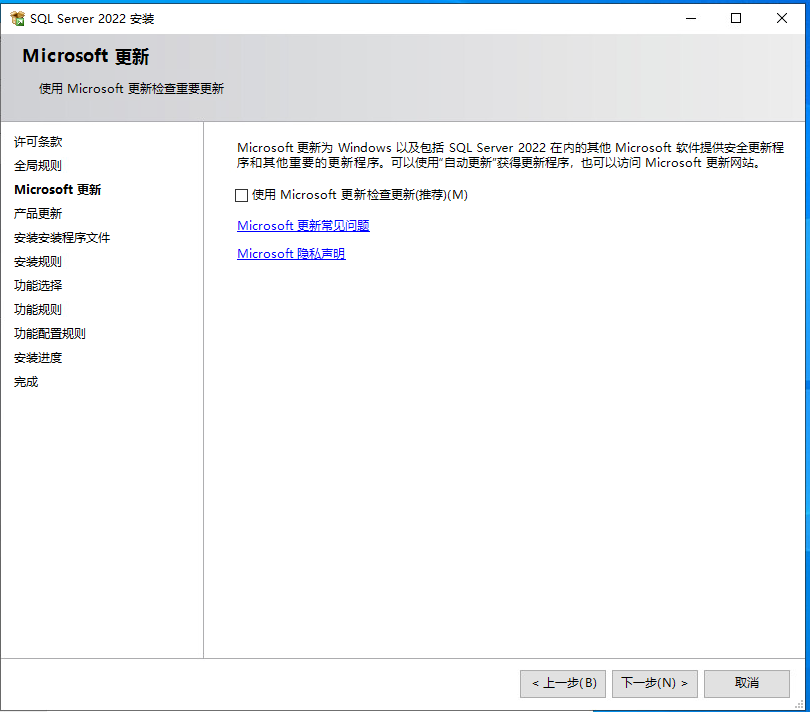

这里安装规则全部都要通过

这里只选择 `数据库引擎服务`，安装位置就默认就行

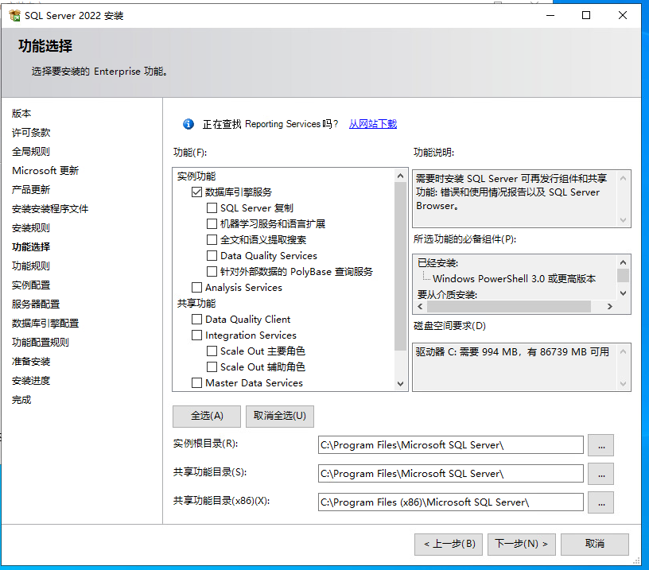

实例配置，默认就行了

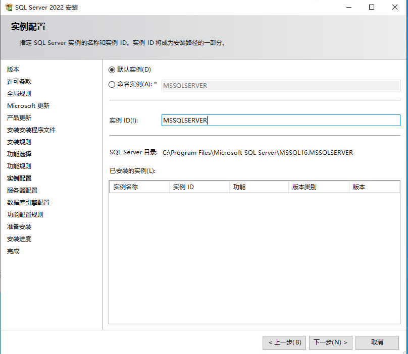

然后服务启动类型，都改为自动启动

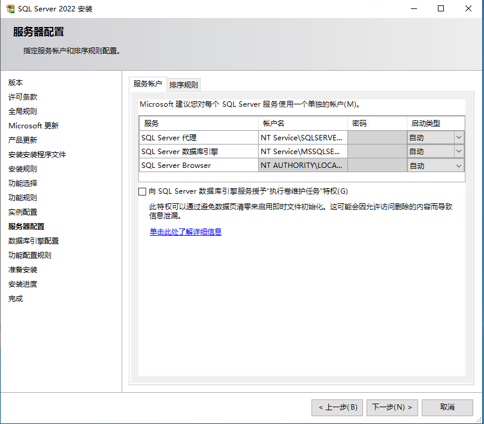

数据库引擎配置，使用“混合模式”设置登陆密码，“添加当前用户”然后下一步

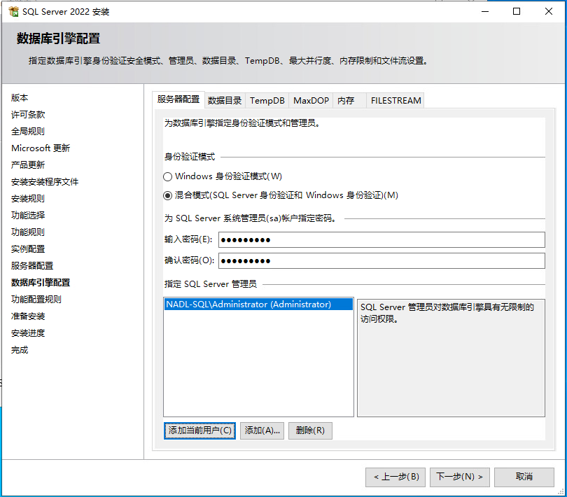

这里直接安装就行了，可以用来检查配置情况

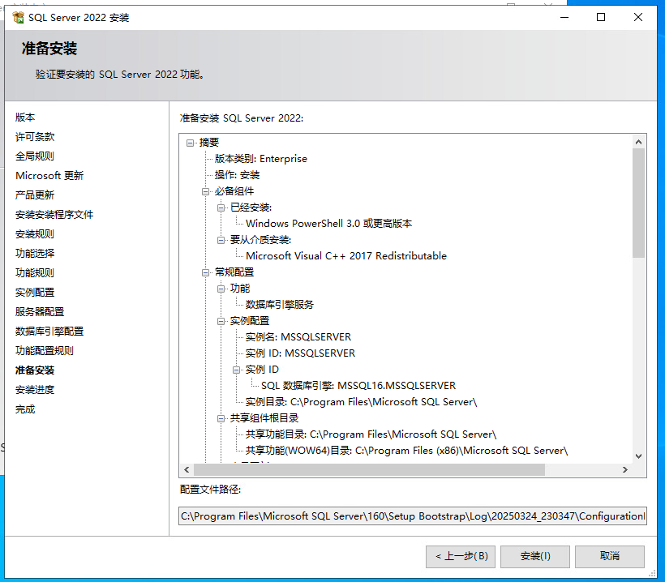

配置完成，关闭即可

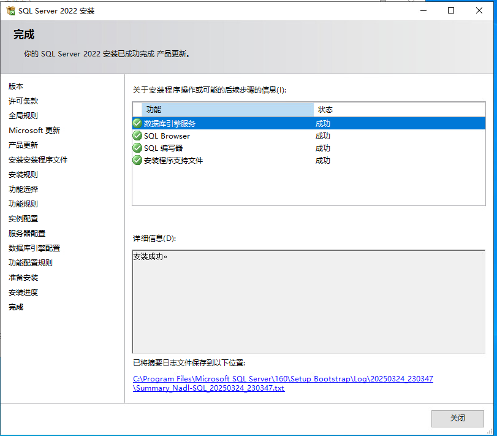

安装管理软件SSMS


直接点击安装即可


安装完成，自动重新启动


## 链接数据库

运行 `SQL Server Management Studio`

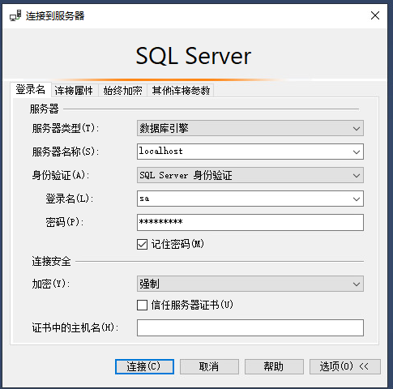

服务器名称：`localhost`

身份验证:`SQL Server 身份验证`

登录名：`sa`

密码：`[安装时填写的sa的密码]`

这里加密要选择可选，不然无法连接

点击导航栏的 `查询`功能

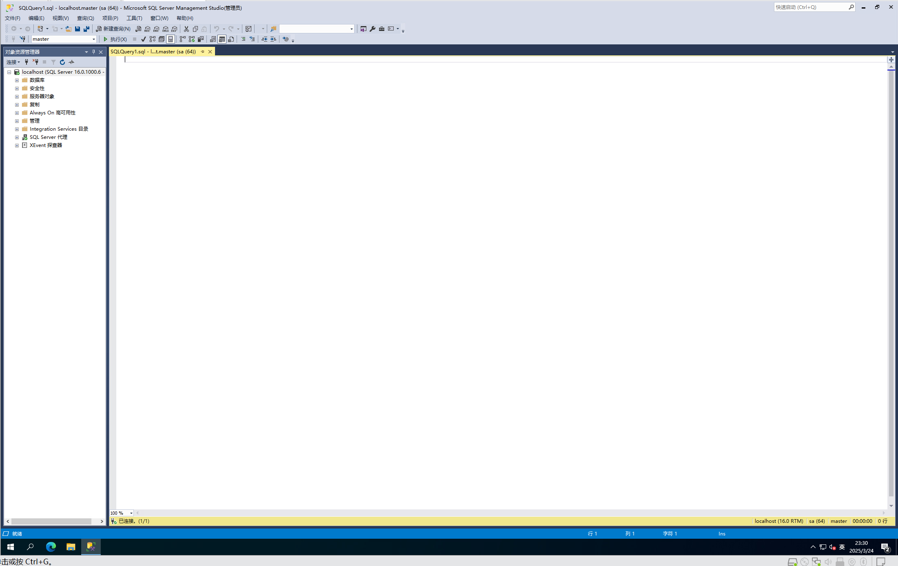

### 查看服务器名称

登录后进行查询：`select @@SERVERNAME;`其实服务器名称就是计算机名，建议本地使用此服务器名称连接


## 远程连接

在windows开始菜单中找到 `SQL Server 配置管理器`

将 `SQL Server 网络配置`–`MSSQLSERVER 的协议`中的 `TCP/IP`设置为启用

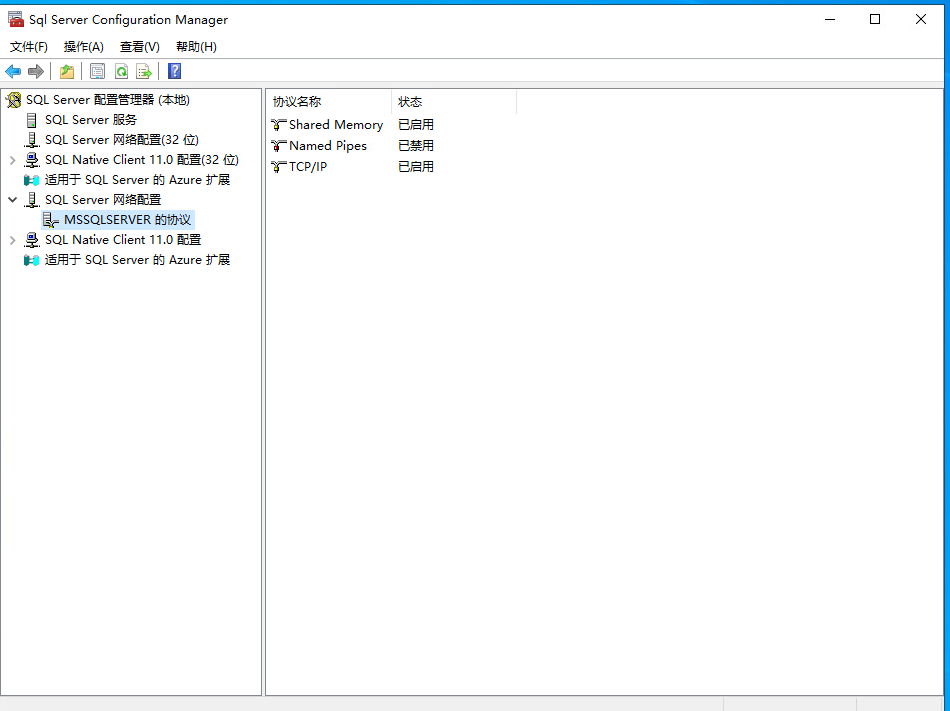

在 `服务`-`SQL Server Browser`设置为自动启动


在Nadl-MWS1上安装 `DataGrip`

选择添加SQL Server

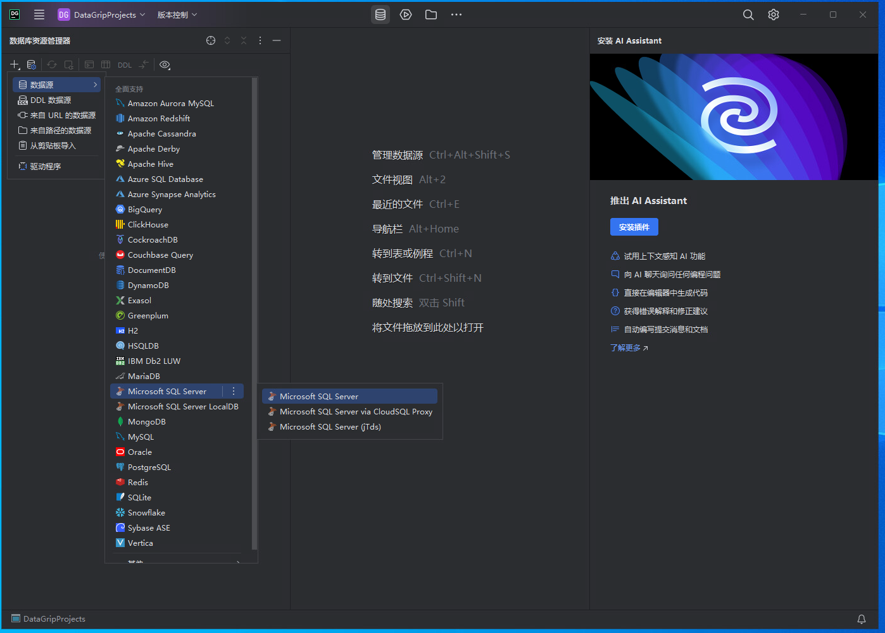

配置样例

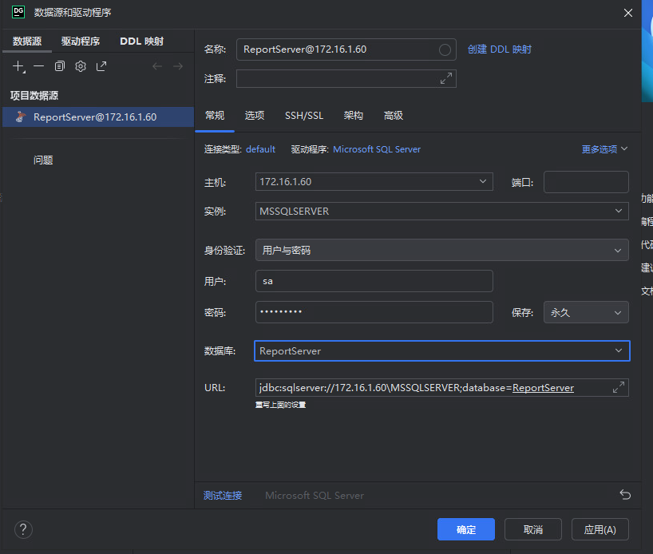
