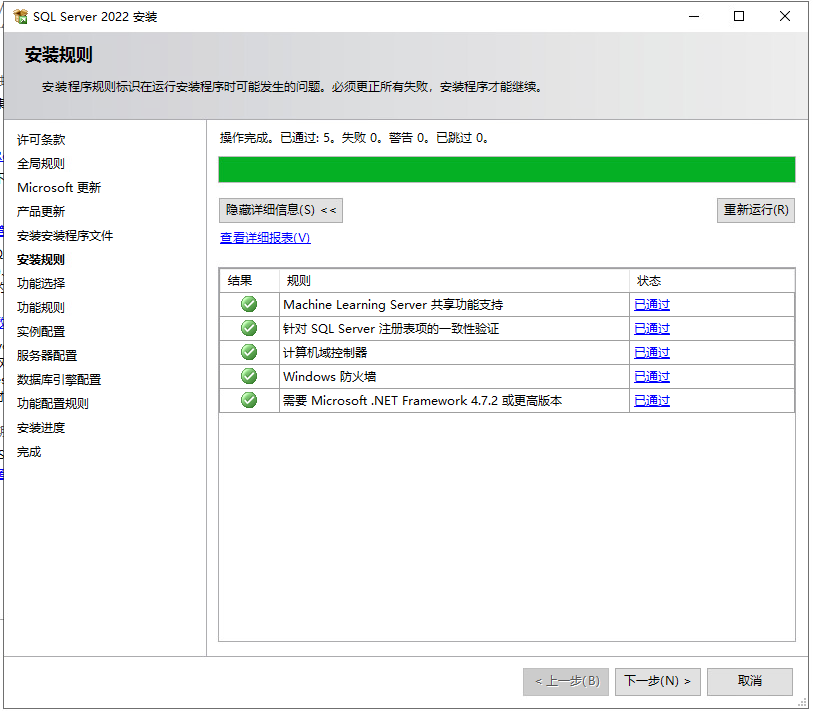
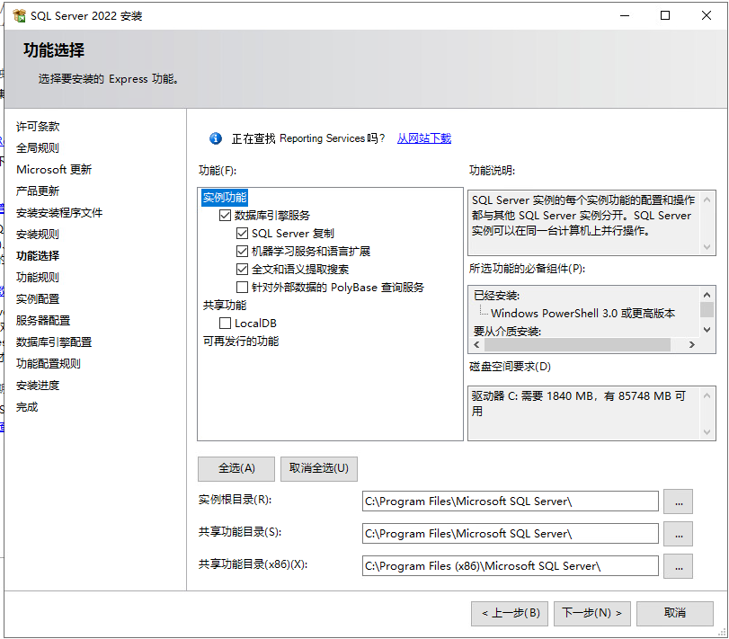

【Horizon】第4章-搭建SQL

<!-- truncate -->

配置一个专用SQL数据库服务器 `MW SQL Server`

## 加入AD域管理

在 `MW SQL Server`上配置Nadl主AD的DNS

检测 `MW SQL Server`能不能访问域名 `nadl.local`

这里可以访问，继续下一步

计算机名/域更改

填写AD主域的账号和密码

在Nadl-MWS1上验证是否加入域

## 安装SQL

进入SQL Server安装页面

接受许可条款

这里不勾选检查更新

这里安装规则全部都要通过

、

功能选择中开启 `数据库引擎服务`

