## 提示

因为我需要使用WindowsAD统一管理所有的账号，因此选择将VCSA也加入WindowsAD域控中进行统一管理

## 前提条件

在**VMware**的VCSA6.0之后的版本内置了PSC，在这个环境下集成微软域控是非常方便的，不需要过多复杂设置就能实现入域并使用微软域账户登陆vCenter。

而在现有的环境中有若干个5.5版的VCSA，希望实现单点登录多VCSA必须借助微软域控账号，这对统一安全管理账号来说是非常有必要的。

## 环境

VCSA版本：VMware vCenter Server-8.0.0.10000

Windows Server版本：Windows Server 2022

## 准备操作

修改VCSA的主机名和DNS

输入https://`VCSA的IP`:5480/进入VCSA控制台

输入账号和密码进入后台管理

进入网络-网络设置-编辑

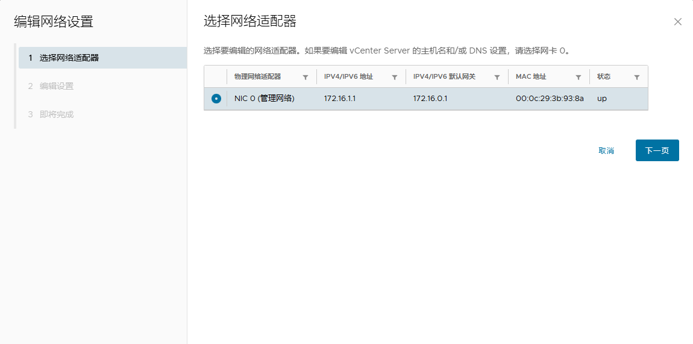

将DNS设置为域控制器的IP

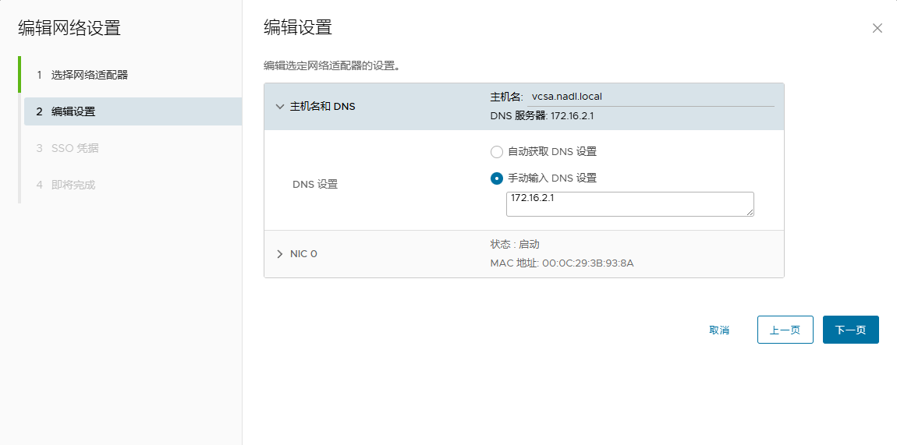

输入SSO凭据

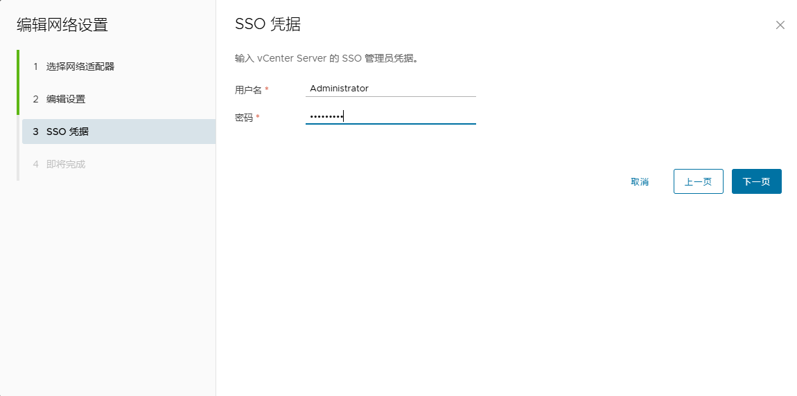

确认配置

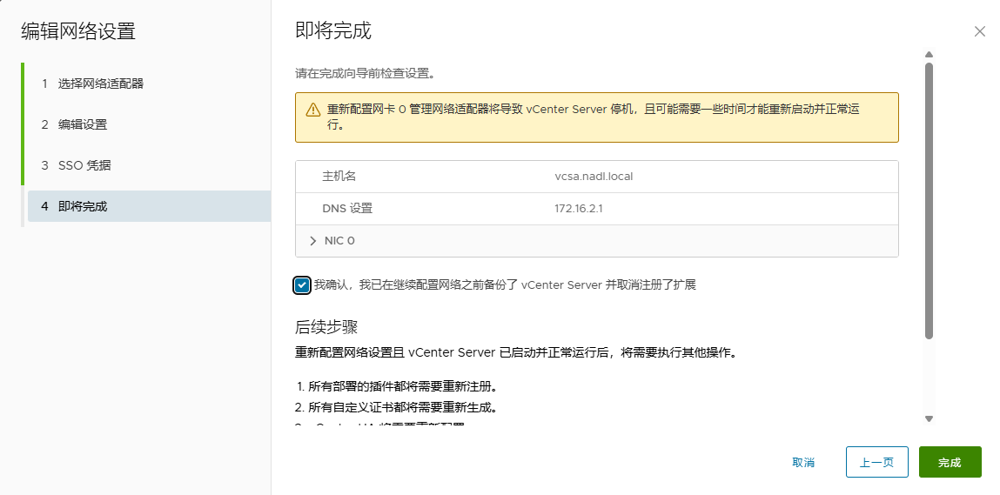

修改完成

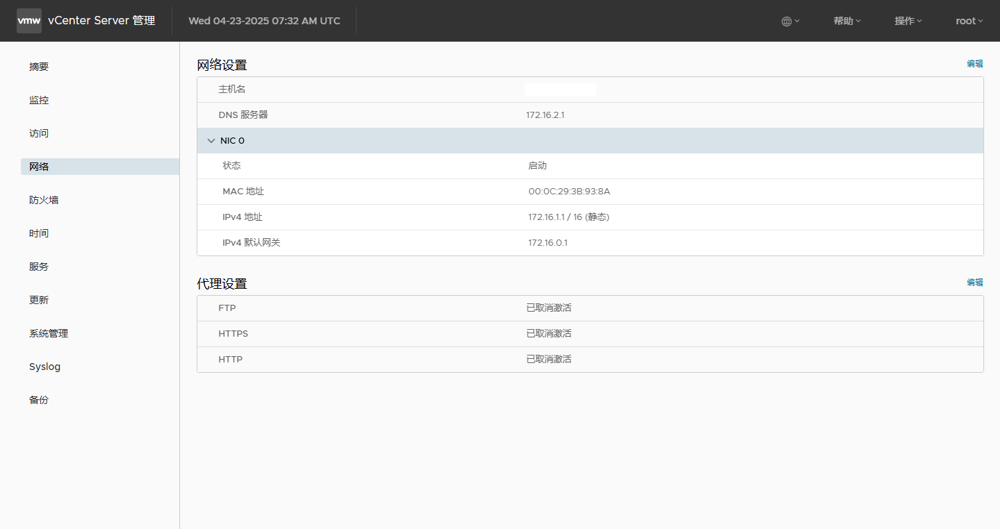

## 加入AD域

创建对接账号

在WindowsAD控制器中创建vcsa用户

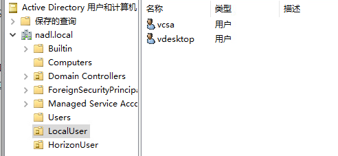

登录VCSA控制台，找到系统管理-Single Sign On-配置

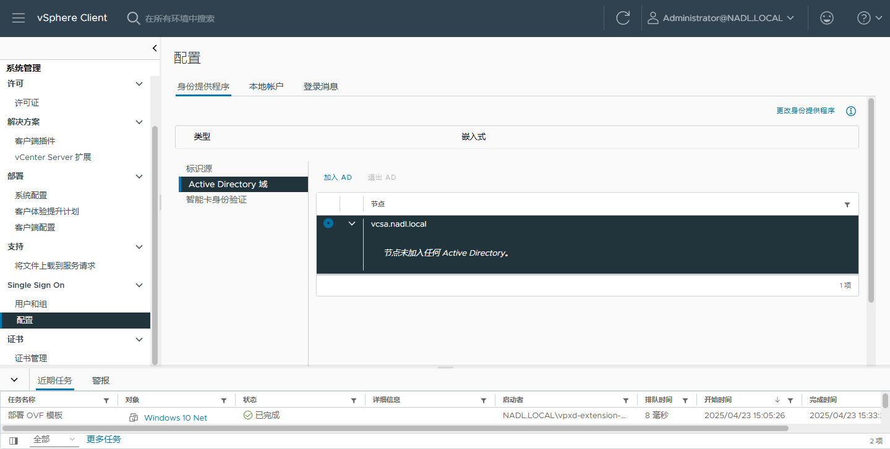

点击加入AD，输入信息

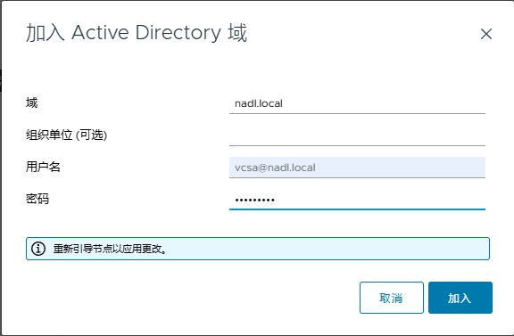

加入成功之后重启VCSA

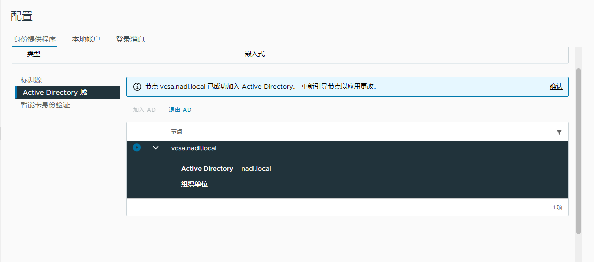

此时在AD域控中可以看到VC已经加入了AD域

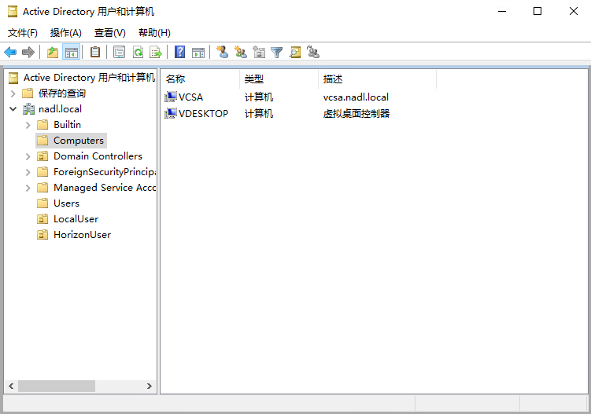

## 配置AD域

重新登录vSphere Client后，返回加域界面。在【标识源】选项卡中点击【添加】，系统会自动跳到【Active Directory（集成**Windows**身份验证）】选项，应在域名中自动填充上一步填写的AD域名，点击【添加】

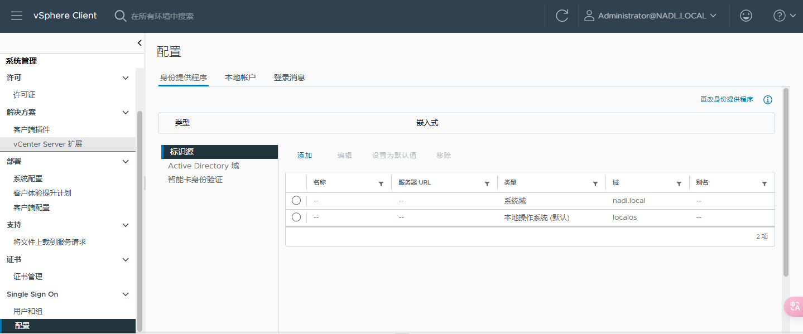

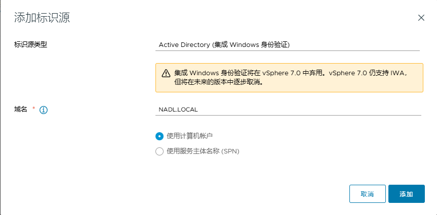
