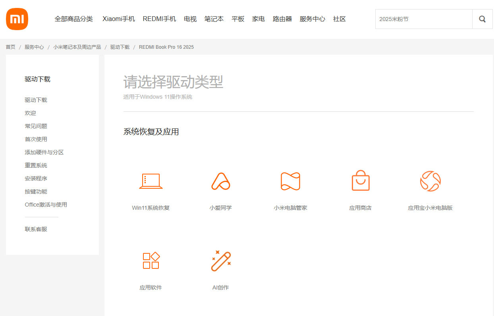
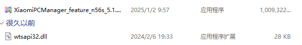

安装最新版小米电脑管家

<!-- truncate -->

> 由于我的设备都是小米/红米系的设备，因此我需要将我的台式主机能够纳入管理，于是有了这篇教程

## 准备工作

在[小米驱动官网](https://www.mi.com/service/notebook/drivers?display=showall)下载最新版小米电脑管家

下载 `小米电脑管家`之后将安装包和 `wtsapi32.dll`放到同级文件夹

## 安装流程

同意协议下一步

安装完成之后下一步即可

## 软件配置

将驱动文件复制到 `C:\Program Files\MI\XiaomiPCManager\5.1.0.174`

重启后打开软件进入主页

首先登录账号，登录完成就可以使用了
