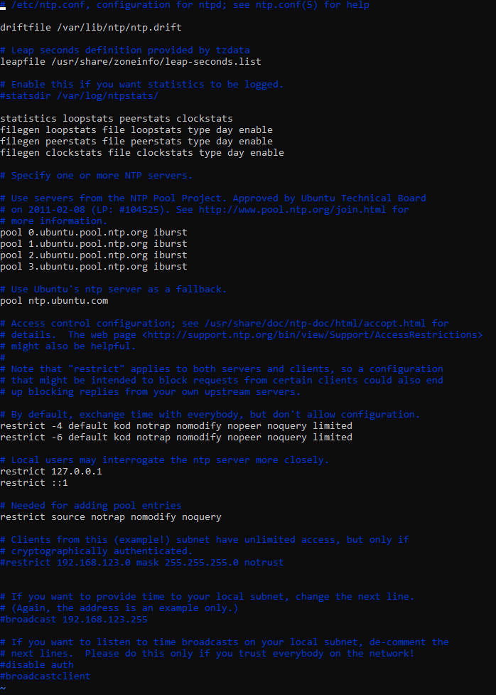

在Ubuntu上安装NTP服务器

<!-- truncate -->

## 安装NTP服务器

在Ubuntu服务器上安装 `ntp`软件包

```bash
sudo apt install -y ntp
```

## 配置NTP服务器

通过对 `ntp.conf`文件配置对应的参数

```bash
sudo vi /etc/ntp.conf
```

如下图：



`pool 0.ubuntu.pool.ntp.org iburst`是ntp配置文件中的一行，用于同步上游ntp服务器

默认可以不更改，以Ubuntu的NTP 源作为同步源，通常建议使用已知的公共NTP服务器，我们配置阿里云为NTP同步源：

```bash
pool ntp1.aliyun.com iburst
pool ntp2.aliyun.com iburst
pool ntp3.aliyun.com iburst
```

## 重启NTP服务器

```bash
sudo systemctl restart ntp
```

输入上述命令重启NTP服务器

## 配置NTP作用域

```bash
restrict 0.0.0.0 mask 0.0.0.0   #允许所有地址访问
```

修改 `restrict`行允许所有地址访问，重启服务器即可
