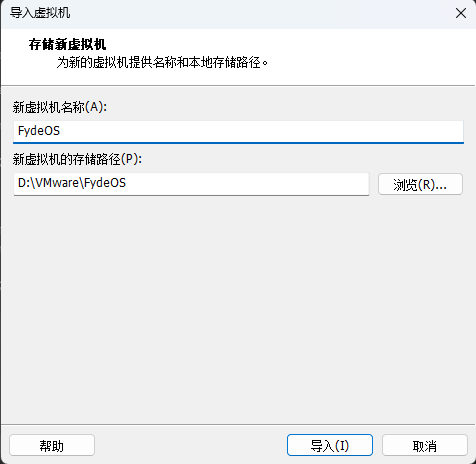
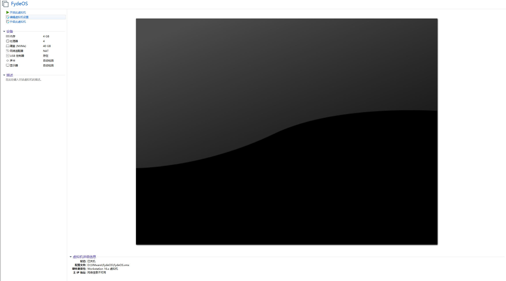
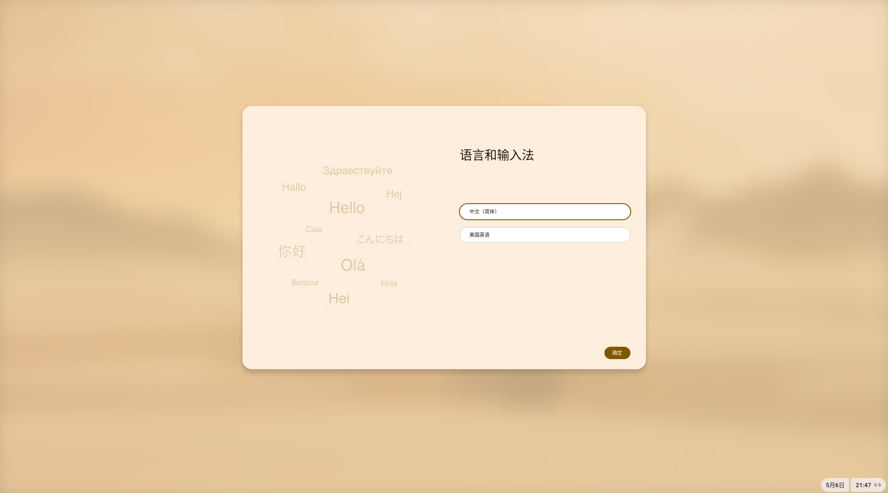
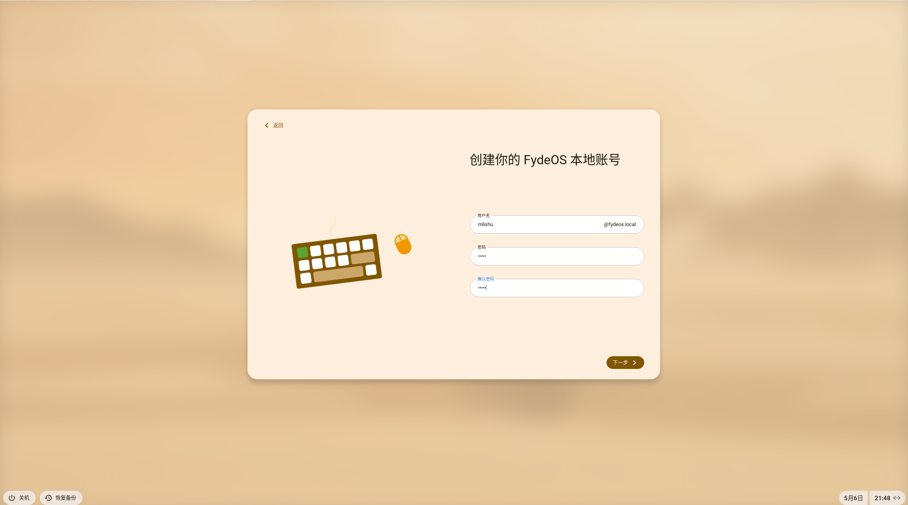
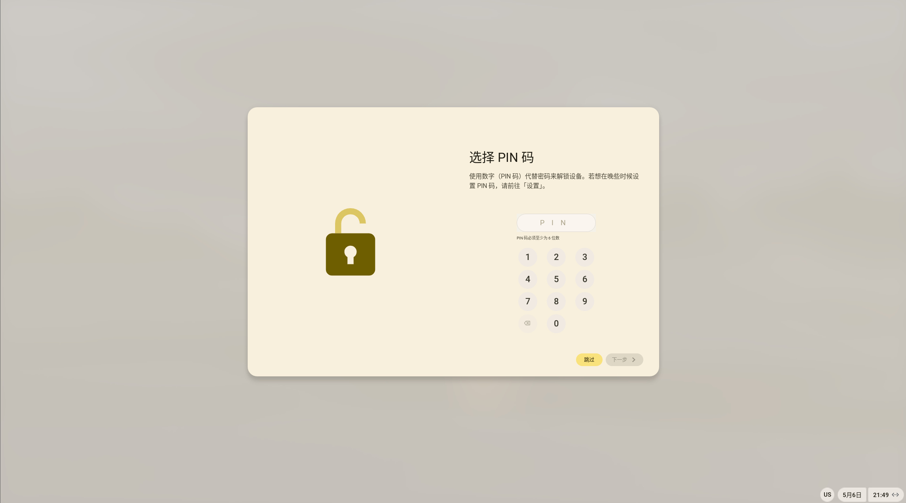
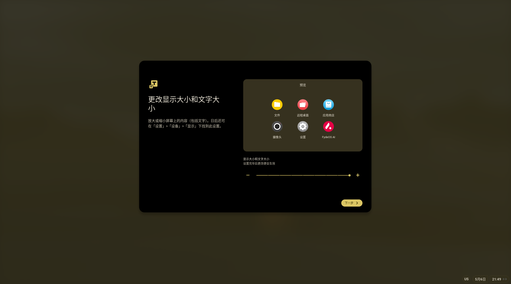
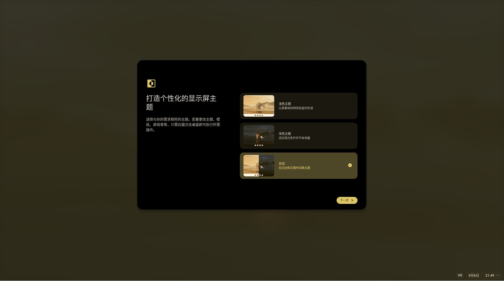

<!-- truncate -->

安装系统

在完成系统下载后，进入VMware，选择导入ova包

这样就导入了FydeOS

这里我们选择升级一下虚拟机，同时修改CPU虚拟化、内存为8G

修改完成之后开启虚拟机即可

这里就是FydeOS配置

## 配置系统

在登录界面选择使用本地账号

配置PIN码

这里将配置显示文字大小

选择自动配置显示

然后就可以使用了，和ChromeOS一样
