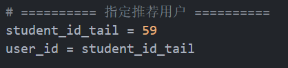
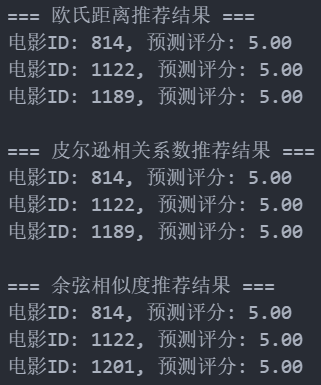

人工智能数学实验2：推荐系统算法

<!-- truncate -->

## 文件列表


## 实验要求

1. 根据电影数据集“u.data”文件生成用户-电影评分矩阵并保存在“评分.csv”文件中；
2. 使用SVD，分别以欧氏距离、皮尔逊相关系数和余弦相似度算法，根据用户-电影评分矩阵为指定（自己学号的最后两位）的用户推荐**三**部电影

## 实验内容

### 1.加载数据集

```python
import pandas as pd
import numpy as np
# 读取数据
data = pd.read_csv('u.data', sep='\t', names=['user_id', 'movie_id', 'rating', 'timestamp'])
# 创建评分矩阵
rating_matrix = data.pivot(index='user_id', columns='movie_id', values='rating').fillna(0)
# 保存评分矩阵
rating_matrix.to_csv('评分.csv')

```

### 2.定义相似度算法

```python
from numpy.linalg import norm
def euclidean_similarity(vec1, vec2):
    return 1 / (1 + norm(vec1 - vec2))
def pearson_similarity(vec1, vec2):
    if len(vec1) < 3:
        return 1.0
    return np.corrcoef(vec1, vec2)[0, 1]
def cosine_similarity(vec1, vec2):
    if norm(vec1) == 0 or norm(vec2) == 0:
        return 0
    return np.dot(vec1, vec2) / (norm(vec1) * norm(vec2))

```

### 3.对物品进行SVD降维

```python
from scipy.sparse.linalg import svds
# 原始评分矩阵
R = rating_matrix.values
# 对矩阵进行 SVD 分解
U, sigma, Vt = svds(R, k=20)
# 将 sigma 转换为对角矩阵
sigma = np.diag(sigma)
# 重构评分矩阵
predicted_ratings = np.dot(np.dot(U, sigma), Vt)
```

### 4.在已降维数据中对用户未打分物品进行评分，返回未打分物品编号及预测分值

```python
def recommend_movies(user_id, similarity_func, top_n=3):
    user_index = user_id - 1  # 索引从0开始
    user_ratings = R[user_index]
    pred_scores = predicted_ratings[user_index]
  
    # 获取用户未评分电影的索引
    unrated_indices = np.where(user_ratings == 0)[0]
    scores = []
    for idx in unrated_indices:
        sim_total = 0
        weighted_sum = 0
        for other_user in range(R.shape[0]):
            if other_user == user_index or R[other_user][idx] == 0:
                continue
            sim = similarity_func(R[user_index], R[other_user])
            sim_total += abs(sim)
            weighted_sum += sim * R[other_user][idx]
        if sim_total == 0:
            score = 0
        else:
            score = weighted_sum / sim_total
        scores.append((idx + 1, score))  # movie_id 从1开始
    # 按预测评分排序
    scores.sort(key=lambda x: x[1], reverse=True)
    return scores[:top_n]

```

### 5.产生前n个评分分值高的物品，返回物品编号及预测评分值

```python
user_id = 59
print("欧氏距离推荐结果：")
print(recommend_movies(user_id, euclidean_similarity))
print("皮尔逊相关系数推荐结果：")
print(recommend_movies(user_id, pearson_similarity))
print("余弦相似度推荐结果：")
print(recommend_movies(user_id, cosine_similarity))
```

### 代码整合

将代码（recommendation_experiment.ipynb）整合之后，将指定推荐用户修改为学号

```python
import pandas as pd
import numpy as np
from numpy.linalg import norm
from scipy.sparse.linalg import svds

# ========== 步骤1：加载数据并生成评分矩阵 ==========
# 读取 MovieLens u.data 数据
data = pd.read_csv('u.data', sep='\t', names=['user_id', 'movie_id', 'rating', 'timestamp'])

# 创建评分矩阵（user_id 行 × movie_id 列），空缺补0
rating_matrix = data.pivot(index='user_id', columns='movie_id', values='rating').fillna(0)
rating_matrix.to_csv('评分.csv')

# 原始评分矩阵
R = rating_matrix.values
user_num, movie_num = R.shape

# ========== 步骤2：定义三种相似度计算方法 ==========
def euclidean_similarity(vec1, vec2):
    return 1 / (1 + norm(vec1 - vec2))

def pearson_similarity(vec1, vec2):
    if np.count_nonzero(vec1) < 3 or np.count_nonzero(vec2) < 3:
        return 0
    return np.corrcoef(vec1, vec2)[0, 1]

def cosine_similarity(vec1, vec2):
    if norm(vec1) == 0 or norm(vec2) == 0:
        return 0
    return np.dot(vec1, vec2) / (norm(vec1) * norm(vec2))

# ========== 步骤3：使用 SVD 降维 ==========
# 保留20个奇异值
U, sigma, Vt = svds(R, k=20)
sigma = np.diag(sigma)
predicted_ratings = np.dot(np.dot(U, sigma), Vt)

# ========== 步骤4 & 5：预测评分 + 推荐电影 ==========
def recommend_movies(user_id, similarity_func, top_n=3):
    user_index = user_id - 1
    user_ratings = R[user_index]
    pred_scores = predicted_ratings[user_index]

    unrated_indices = np.where(user_ratings == 0)[0]
    scores = []

    for idx in unrated_indices:
        sim_total = 0
        weighted_sum = 0
        for other_user in range(user_num):
            if other_user == user_index or R[other_user][idx] == 0:
                continue
            sim = similarity_func(R[user_index], R[other_user])
            if np.isnan(sim):
                continue
            sim_total += abs(sim)
            weighted_sum += sim * R[other_user][idx]
        score = weighted_sum / sim_total if sim_total != 0 else 0
        scores.append((idx + 1, score))  # movie_id = idx + 1

    # 返回评分最高的top_n部电影
    scores.sort(key=lambda x: x[1], reverse=True)
    return scores[:top_n]

# ========== 指定推荐用户 ==========
student_id_tail = 59
user_id = student_id_tail

# ========== 输出推荐结果 ==========
print("=== 欧氏距离推荐结果 ===")
for movie_id, score in recommend_movies(user_id, euclidean_similarity):
    print(f"电影ID: {movie_id}, 预测评分: {score:.2f}")

print("\n=== 皮尔逊相关系数推荐结果 ===")
for movie_id, score in recommend_movies(user_id, pearson_similarity):
    print(f"电影ID: {movie_id}, 预测评分: {score:.2f}")

print("\n=== 余弦相似度推荐结果 ===")
for movie_id, score in recommend_movies(user_id, cosine_similarity):
    print(f"电影ID: {movie_id}, 预测评分: {score:.2f}")

```

## 运行截图

### 修改ID



### 结果


