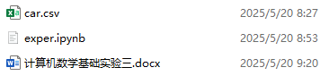
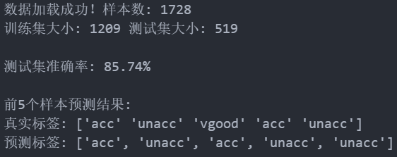

人工智能数学实验2：推荐系统算法

<!-- truncate -->

## 文件列表



## 实验要求

1. 定义函数getDataSet()从数据文件“car.txt”中读取数据集，并以DataFrame数据类型存储读取的数据集。定义函数getTrainData()将数据集分为训练集和测试集；
2. 创建类NBClassify实现朴素贝叶斯模型，包含属性tagProbility记录各类别的先验概率，和属性featuresProbility记录各类别下各个特征取值的条件概率，定义训练函数train()利用训练集数据计算先验概率和似然概率，定义函数classify()对测试集数据进行分类；
3. 调用定义的函数，对测试集数据进行分类，输出预测的准确率。

## 实验内容

### 需求1

定义函数getDataSet()从数据文件“car.txt”中读取数据集，并以DataFrame数据类型存储读取的数据集。定义函数getTrainData()将数据集分为训练集和测试集

```python
import pandas as pd
from sklearn.model_selection import train_test_split

def getDataSet(filename):
    # 定义列名
    columns = ['buying', 'maint', 'doors', 'persons', 'lug_boot', 'safety', 'class']
    # 读取数据文件
    data = pd.read_csv(filename, header=None, names=columns)
    return data

def getTrainData(data, test_size=0.3, random_state=42):
    # 分割特征和标签
    X = data.iloc[:, :-1]
    y = data.iloc[:, -1]
    # 分割训练集和测试集
    X_train, X_test, y_train, y_test = train_test_split(X, y, test_size=test_size, 
                                                       random_state=random_state, 
                                                       stratify=y)
    return X_train, X_test, y_train, y_test
```

### 需求2

创建类NBClassify实现朴素贝叶斯模型，包含属性tagProbility记录各类别的先验概率，和属性featuresProbility记录各类别下各个特征取值的条件概率，定义训练函数train()利用训练集数据计算先验概率和似然概率，定义函数classify()对测试集数据进行分类

```python
import numpy as np
from collections import defaultdict

class NBClassify:
    def __init__(self):
        self.tagProbility = {}      # 存储类别的先验概率
        self.featuresProbility = {} # 存储各类别下各个特征取值的条件概率
  
    def train(self, X_train, y_train):
        # 计算各类别的先验概率
        total_samples = len(y_train)
        class_counts = y_train.value_counts().to_dict()
    
        for cls, count in class_counts.items():
            self.tagProbility[cls] = count / total_samples
    
        # 计算各类别下各个特征的条件概率
        for cls in class_counts.keys():
            # 获取当前类别的所有样本
            cls_samples = X_train[y_train == cls]
        
            # 存储当前类别的特征概率
            self.featuresProbility[cls] = defaultdict(dict)
        
            # 对每个特征计算条件概率
            for feature in X_train.columns:
                feature_counts = cls_samples[feature].value_counts().to_dict()
                total_feature = sum(feature_counts.values())
            
                # 使用拉普拉斯平滑处理
                unique_values = X_train[feature].unique()
                for value in unique_values:
                    count = feature_counts.get(value, 0)
                    self.featuresProbility[cls][feature][value] = (count + 1) / (total_feature + len(unique_values))
  
    def classify(self, X_test):
        predictions = []
    
        for _, sample in X_test.iterrows():
            max_prob = -1
            predicted_class = None
        
            # 对每个类别计算后验概率
            for cls in self.tagProbility.keys():
                # 初始化为类别的先验概率
                prob = np.log(self.tagProbility[cls])
            
                # 累加各个特征的条件概率的对数
                for feature in X_test.columns:
                    feature_value = sample[feature]
                
                    # 如果特征值在训练集中未出现过，使用拉普拉斯平滑的最小概率
                    if feature_value in self.featuresProbility[cls][feature]:
                        prob += np.log(self.featuresProbility[cls][feature][feature_value])
                    else:
                        # 使用一个很小的概率值，避免零概率问题
                        min_prob = 1e-10
                        prob += np.log(min_prob)
            
                # 选择概率最大的类别
                if prob > max_prob:
                    max_prob = prob
                    predicted_class = cls
        
            predictions.append(predicted_class)
    
        return predictions
  
    def accuracy(self, y_true, y_pred):
        correct = sum(1 for true, pred in zip(y_true, y_pred) if true == pred)
        return correct / len(y_true)
```

### 需求3

调用定义的函数，对测试集数据进行分类，输出预测的准确率z

```python
# 主程序
if __name__ == "__main__":
    # 1. 读取数据
    data = getDataSet("car.txt")
    print("数据集前5行：")
    print(data.head())
    print("\n类别分布：")
    print(data['class'].value_counts())
  
    # 2. 分割训练集和测试集
    X_train, X_test, y_train, y_test = getTrainData(data)
    print("\n训练集大小:", len(X_train))
    print("测试集大小:", len(X_test))
  
    # 3. 训练朴素贝叶斯模型
    nb = NBClassify()
    nb.train(X_train, y_train)
  
    # 4. 在测试集上进行预测
    y_pred = nb.classify(X_test)
  
    # 5. 计算准确率
    acc = nb.accuracy(y_test, y_pred)
    print("\n测试集准确率: {:.2f}%".format(acc * 100))
  
    # 打印一些预测结果示例
    print("\n前10个测试样本的真实标签和预测标签：")
    for true, pred in zip(y_test[:10], y_pred[:10]):
        print(f"真实: {true}, 预测: {pred}")
```

## 数据结果


