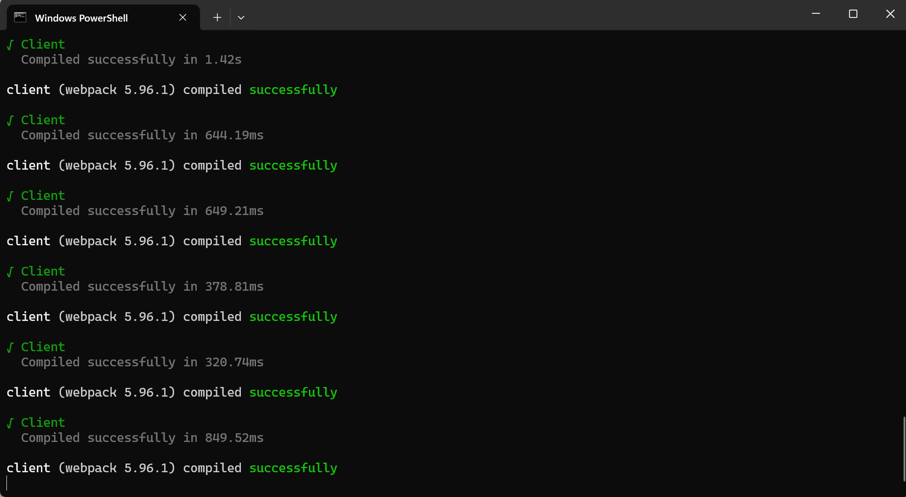

## 第一次使用

在安装完 `NPM`之后，我们需要安装部分服务用于本地开发云笔记

## 安装pnpm

由于云笔记使用的是pnpm开发，因此需要安装pnpm服务

```
npm install -g pnpm
```

在安装pnpm之后，安装pnpm框架

```
pnpm install

```

## 本地调试

首先要声明一点，如果在本地调试中未发现错误，则可以直接上传到云，成功如下图


