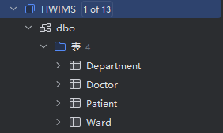
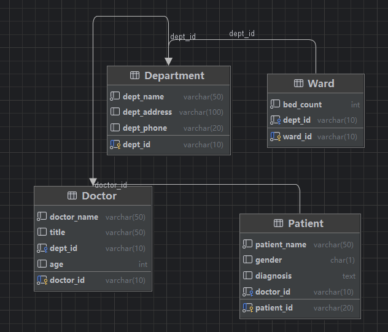

## 实验目的实现

`DataGrip`虽然主要是数据库管理工具，但也能支持概念模型设计：

1. E-R图设计 ：可以使用DataGrip的数据库图表功能来可视化表结构
2. 数据建模 ：通过创建表结构实现
3. 概念模型到物理模型 ：在DataGrip中直接创建表结构
4. 生成物理数据库 ：DataGrip可以直接执行SQL语句创建数据库

## 医院病房管理系统设计步骤

### 1 创建实体(表)

在 `DataGrip`中创建表对应实验中的实体：

```
-- 科室表
CREATE TABLE Department (
    dept_id VARCHAR(10) PRIMARY KEY,  -- 科室编号
    dept_name VARCHAR(50) NOT NULL,   -- 科室名
    dept_address VARCHAR(100),        -- 科室地址
    dept_phone VARCHAR(20)            -- 科室电话
);

-- 病房表
CREATE TABLE Ward (
    ward_id VARCHAR(10) PRIMARY KEY,  -- 病房号
    bed_count INT NOT NULL,            -- 床位号
    dept_id VARCHAR(10) NOT NULL,      -- 所属科室编号
    FOREIGN KEY (dept_id) REFERENCES Department(dept_id)
);

-- 医生表
CREATE TABLE Doctor (
    doctor_id VARCHAR(10) PRIMARY KEY, -- 工作证号
    doctor_name VARCHAR(50) NOT NULL,  -- 姓名
    title VARCHAR(50),                 -- 职称
    dept_id VARCHAR(10) NOT NULL,      -- 所属科室编号
    age INT,                           -- 年龄
    FOREIGN KEY (dept_id) REFERENCES Department(dept_id)
);

-- 病人表
CREATE TABLE Patient (
    patient_id VARCHAR(20) PRIMARY KEY, -- 病历号
    patient_name VARCHAR(50) NOT NULL,  -- 姓名
    gender CHAR(1) CHECK (gender IN ('M', 'F')), -- 性别
    diagnosis TEXT,                     -- 诊断信息
    doctor_id VARCHAR(10) NOT NULL,     -- 主管医生
    FOREIGN KEY (doctor_id) REFERENCES Doctor(doctor_id)
);
```

创建完成后的数据库表



### 2 创建数据库图表(可视化E-R图)

1. 在DataGrip中，右键点击您的数据库连接
2. 右键选择"图" > "显示图"

   
3. DataGrip会自动显示表之间的关系

   

### 3 添加约束

在表创建语句中已经添加了：

* 主键约束(PRIMARY KEY)
* 外键约束(FOREIGN KEY)
* 检查约束(CHECK)
* 非空约束(NOT NULL)

## 思考题解答建议

1. **联系类型分析** ：通过表之间的关系(一对一、一对多、多对多)来分析Dependent、Mandatory、Cardinality的含义
2. **关系转化** ：分析不同关系类型在数据库中的实现方式
3. **显示设置** ：虽然DataGrip没有完全相同的功能，但可以讨论数据库对象的命名规范
