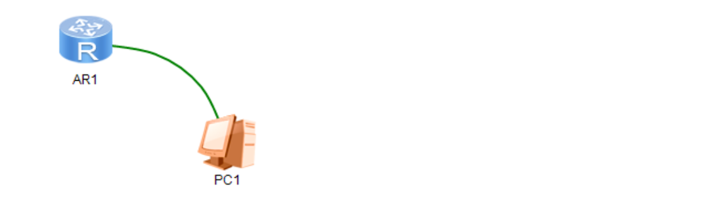
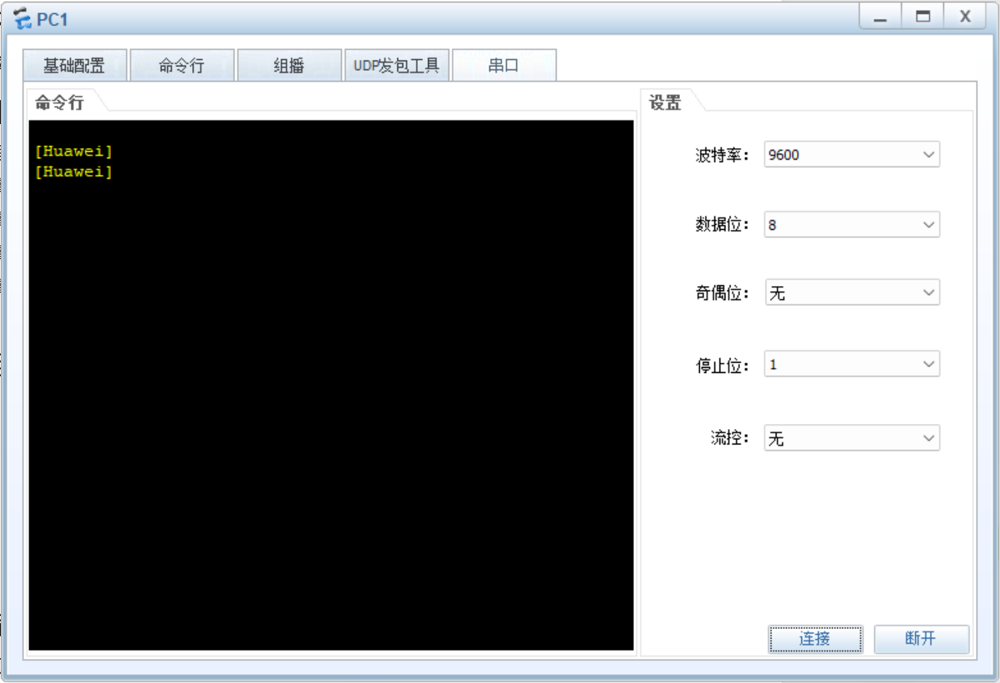
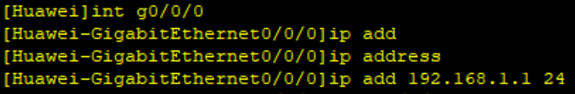
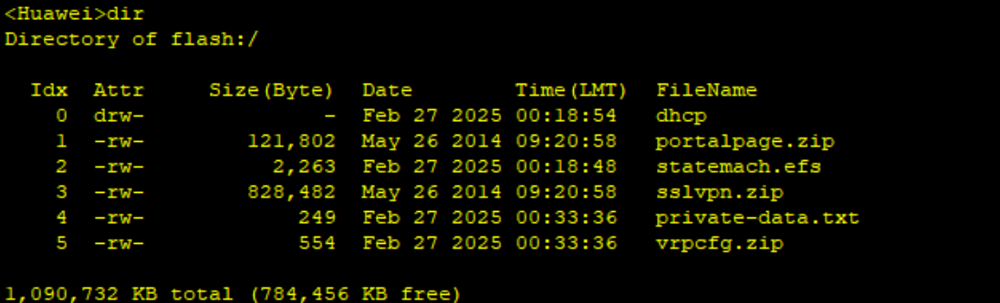

<!-- truncate -->

## 正文

### 使用PC配置路由器

使用Console线缆连接，如下图



连接方式：Console（Router）---RS232（PC）

下图展示了PC1使用Console线路管理路由器



### 基础命令

```bash
<Huawei>system-view   #进入系统视图
```

可以使用 `?`或 `Tab`检查命令

```bash
[Huawei]display   #显示命令
```

在VRP系统中可以经常使用 `Tab`或者 `?`

#### 配置接口IP

```badh
[Huawei]int g0/0/0
[Huawei-GigabitEthernet0/0/0]ip add 192.168.1.1 24
```

在这里省略了一些代码，但是可以正常运行



PS:一个三层设备的每个接口，应该在不同的网段；一条线缆两端一定是同一个网段

### 保存配置

```bash
<Huawei>save
```

保存设备配置，只要配置了代码，都需要 `save`保存代码

配置文件放在vrpcfg.zip内


