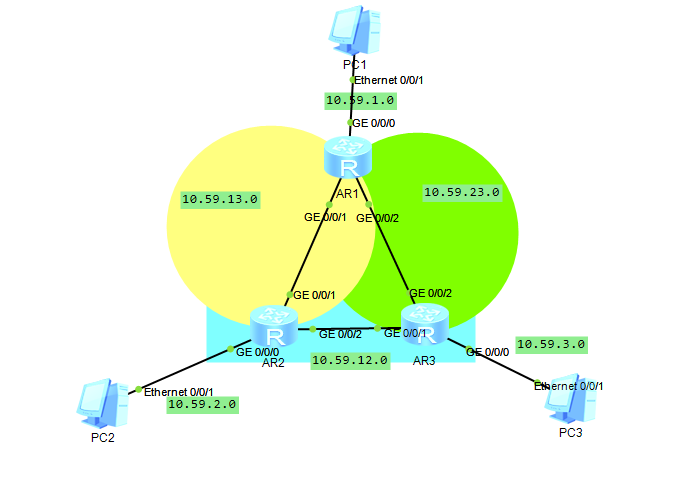

## 拓扑图



## 代码

### [AR1]

```
int g0/0/0
ip add 10.59.1.254 24
int g0/0/1
ip add 10.59.13.1 24
int g0/0/2
ip add 10.59.23.1 24
q
ip route-static 10.59.2.1 24 10.59.13.2
ip route-static 10.59.3.1 24 10.59.23.3
```

### [AR2]

```
int g0/0/0
ip add 10.59.2.254 24
int g0/0/1
ip add 10.59.13.2 24
int g0/0/2
ip add 10.59.12.2 24
q
ip route-static 10.59.1.1 24 10.59.13.1
ip route-static 10.59.3.1 24 10.59.12.3
```

### [AR3]

```
int g0/0/0
ip add 10.59.3.254 24
int g0/0/1
ip add 10.59.12.3 24
int g0/0/2
ip add 10.59.23.3 24
q
ip route-static 10.59.1.1 24 10.59.23.1
ip route-static 10.59.2.1 24 10.59.12.2
```

然后给PC配上地址和网关就可以了
