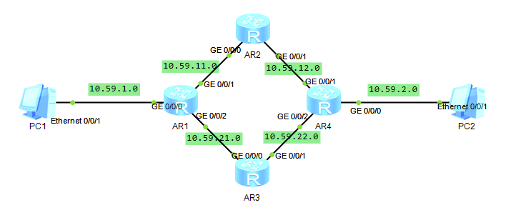
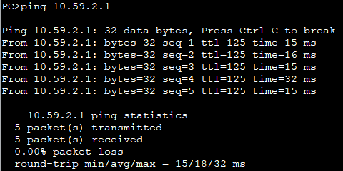

## 拓扑图



## 路由规划

| Route | GE0/0/0     | GE0/0/1    | GE0/0/2    |
| ----- | ----------- | ---------- | ---------- |
| AR1   | 10.59.1.254 | 10.59.11.1 | 10.59.21.1 |
| AR2   | 10.59.11.2  | 10.59.12.2 |            |
| AR3   | 10.59.21.3  | 10.59.22.3 |            |
| AR4   | 10.59.2.254 | 10.59.12.4 | 10.59.22.4 |

## 配置

### [AR1]

```
int g0/0/0
ip add 10.59.1.254 24
int g0/0/1
ip add 10.59.11.1 24
int g0/0/2
ip add 10.59.21.1 24
q
ip route-static 10.59.2.0 24 10.59.11.2
ip route-static 10.59.2.0 24 10.59.21.3 pre 90
```

### [AR2]

```
int g0/0/0
ip add 10.59.11.2 24
int g0/0/1
ip add 10.59.12.2 24
q
ip route-static 10.59.1.0 24 10.59.11.1
ip route-static 10.59.2.0 24 10.59.12.4
```

### [AR3]

```
int g0/0/0
ip add 10.59.21.3 24
int g0/0/1
ip add 10.59.22.3 24
q
ip route-static 10.59.1.0 24 10.59.21.1
ip route-static 10.59.2.0 24 10.59.22.4
```

### [AR4]

```
int g0/0/0
ip add 10.59.2.254 24
int g0/0/1
ip add 10.59.12.4 24
int g0/0/2
ip add 10.59.22.4 24
q
ip route-static 10.59.1.0 24 10.59.12.2
ip route-static 10.59.1.0 24 10.59.22.3 pre 90
```

## 连通性验证


