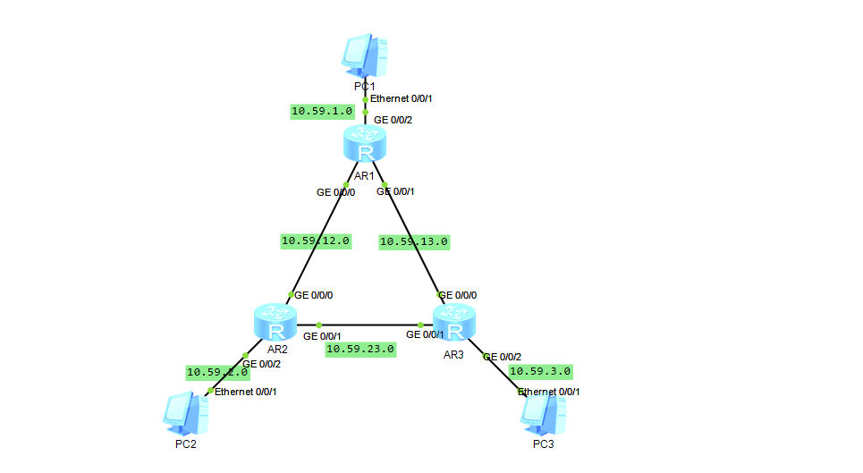

## 拓朴图



## 路由规划

| Route | GE0/0/0    | GE0/01     | GE0/0/2     |
| ----- | ---------- | ---------- | ----------- |
| AR1   | 10.59.12.1 | 10.59.13.1 | 10.59.1.254 |
| AR2   | 10.59.12.2 | 10.59.23.2 | 10.59.2.254 |
| AR3   | 10.59.13.3 | 10.59.23.3 | 10.59.3.254 |

## 配置代码

代码部分省略了端口IP的配置

[AR1]

```
ospf 1
area 0
network 10.59.12.0 0.0.0.255
network 10.59.13.0 0.0.0.255
network 10.59.1.0 0.0.0.255
```

[AR2]

```
ospf 1
area 0
network 10.59.12.0 0.0.0.255
network 10.59.23.0 0.0.0.255
network 10.59.2.0 0.0.0.255
```

[AR3]

```
ospf 1
area 0
network 10.59.13.0 0.0.0.255
network 10.59.23.0 0.0.0.255
network 10.59.3.0 0.0.0.255
```
