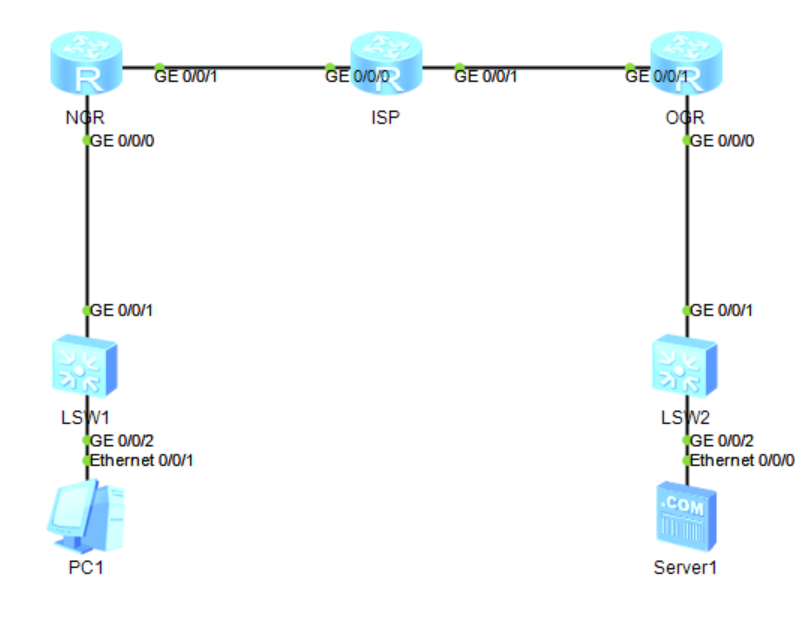

## 实验拓扑



## 配置代码

### IP配置

#### NGR

```
int g0/0/0
ip add 192.168.1.254 24
int g0/0/1
ip add 10.0.0.1 24
quit
ip route-static 0.0.0.0 0 10.0.0.2
ospf 1
area 0
network 10.0.0.0 0.0.0.255
```

#### ISP

```
int g0/0/0
ip add 10.0.0.2 24
int g0/0/1
ip add 10.0.1.1 24
quit
ospf 1
area 0
network 10.0.0.0 0.0.0.255
network 10.0.1.0 0.0.0.255
```

#### OGR

```
int g0/0/0
ip add 192.168.2.254 24
int g0/0/1
ip add 10.0.1.2 24
quit
ip route-static 0.0.0.0 0 10.0.1.1
ospf 1
area 0
network 10.0.1.0 0.0.0.255
```

### IPSec配置

#### NGR

```
acl 3000
rule deny ip source 192.168.1.0 0.0.0.255 destination 192.168.2.0 0.0.0.255
rule permit ip source any destination any
quit
int g0/0/1
nat outbound 3000
quit
ike proposal 10 
authentication-algorithm sha1
authentication-method pre-share 
encryption-algorithm aes-cbc-128
dh group2
quit
ike peer r1-r3 v1
pre-shared-key cipher abc-123
remote-address 10.0.1.2
ike-proposal 10
quit
acl 3001
rule permit ip source 192.168.1.0 0.0.0.255 destination 192.168.2.0 0.0.0.255
quit
ipsec proposal aqty1
esp authentication-algorithm  sha1
esp encryption-algorithm aes-128
quit
ipsec policy aqcl 10 isakmp 
ike-peer r1-r3
proposal aqty1
security acl 3001
quit
int g0/0/1
ipsec policy aqcl
quit
```

#### OGR

```
acl 3000
rule deny ip source 192.168.2.0 0.0.0.255 destination 192.168.1.0 0.0.0.255
rule permit ip source any destination any
quit
int g0/0/1
nat outbound 3000
quit
ike proposal 10
authentication-algorithm sha1
authentication-method pre-share 
encryption-algorithm aes-cbc-128
dh group2
quit
ike peer r3-r1 v1
pre-shared-key cipher abc-123
remote-address 10.0.0.1
ike-proposal 10
quit
acl 3001
rule permit ip source 192.168.2.0 0.0.0.255 destination 192.168.1.0 0.0.0.255
quit
ipsec proposal aqty1
esp authentication-algorithm sha1
esp encryption-algorithm aes-128
quit
ipsec policy aqcl 10 isakmp 
ike-peer r3-r1
proposal aqty1
security acl 3001
quit
int g0/0/1
ipsec policy aqcl
quit
```
