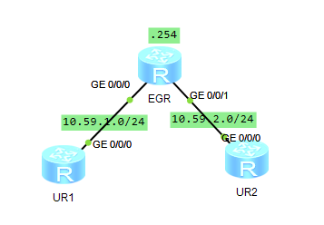
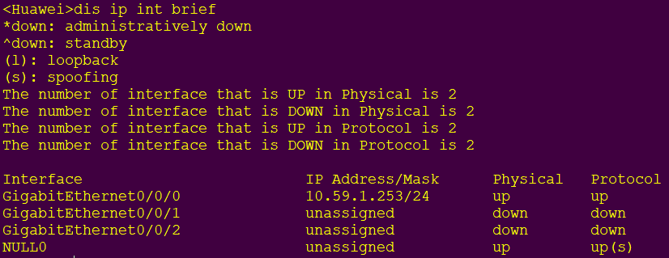
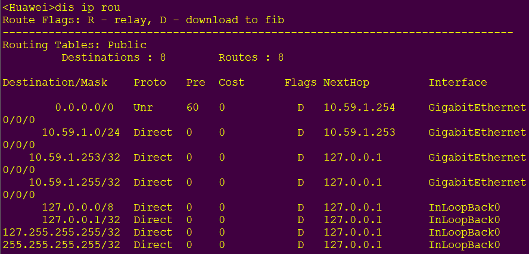

## 实验拓扑



## IP规划

|                | G0/0/0      | G0/0/1      |
| -------------- | ----------- | ----------- |
| EGR            | 10.59.1.254 | 10.59.2.254 |
| LoopBack0(EGR) | 10.0.0.1    |             |

## 配置代码

在EGR、UR1、UR2上启用DHCP功能

```
dhcp enable
```

在启用DHCP功能后，给接口配置IP地址

### 服务端

#### 创建全局地址池

```
ip pool DHCPPool
network 10.59.1.0 mask 24
dns-list 10.0.0.1
gateway-list 10.59.1.254
least day 2 hour 2
```

`static-bind`命令可用于绑定IP与Mac地址

```
[R1-ip-pool-DHCPPool]static-bind ip-address 10.59.1.1 mac-address 00e0-fc6f-6d1f
```

#### 将DHCP池绑定到接口

```
int g0/0/0
dhcp select global
```

#### 配置接口DHCP

```
int g0/0/1
dhcp select interface
dhcp server dns-list 10.0.0.1
```

### 客户端

在AR1上举例

```
int g0/0/0
ip add dhcp-alloc
```

## 验证DHCP分发



同时可以观察到DHCP为客户端分配了的时候写入了一条静态路由指向服务端


