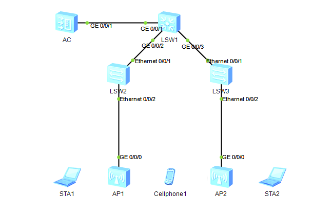

## 实验拓扑



## 配置代码

配置VLAN100作为管理VLAN，VLAN101作为业务VLAN

### 创建VLAN

#### LSW1

```
vlan batch 100 101
int vlanif101
ip add 192.168.101.254 24
int g0/0/1
port link-type trunk
port trunk allow-pass vlan all
int g0/0/2
port link-type trunk
port trunk allow-pass vlan all
int g0/0/3
port link-type trunk
port trunk allow-pass vlan all
```

#### AC

```
vlan batch 100 101
int vlanif100
ip add 192.168.100.254 24
int g0/0/1
port link-type trunk
port trunk allow-pass vlan all
```

#### LSW2和LSW3

```
vlan batch 100 101
int e0/0/1
port link-type trunk
port trunk allow-pass vlan all
int e0/0/2
port link-type trunk
port trunk pvid vlan 100
port trunk allow-pass vlan all
```

在LSW1上配置环回口做测试

```
int loopback 0
ip add 10.0.0.1 24
```

### 配置DHCP

#### LSW1

```
dhcp enable
ip pool user # user是DHCP组名字
network 192.168.101.0 mask 24
gateway-list 192.168.101.254
quit
# 在接口配置DHCP池
int vlanif 101
dhcp select global
```

#### AC

```
dhcp enable
ip pool ap # ap是DHCP组名字
network 192.168.100.0 mask 24
gateway-list 192.168.100.254
quit
# 在接口配置DHCP池
int vlanif 100
dhcp select global
```

### 配置AP

创建AP组同时配置AC的国家码

```
wlan
regulatory-domain-profile name default
country-code CN
quit
ap-group name ap-group1
regulatory-domain-profile default
```

这里需要手动输入y确认
