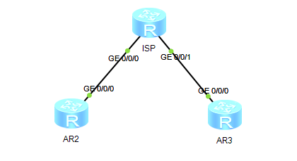
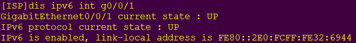
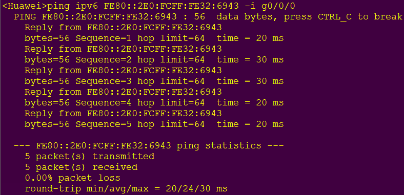

## 实验拓扑



## 配置代码

### 全局使能IPv6

在AR2、AR3、ISP上启动IPv6功能

```
ipv6
```

### 接口使能IPv6

#### ISP

```
int g0/0/0
ipv6 enable
int g0/0/1
ipv6 enable
```

#### AR2、AR3

```
int g0/0/0
ipv6 enable
```

### 配置接口自动生成 `link-local`地址

#### ISP

```
int g0/0/0
ipv6 add auto link-local
int g0/0/1
ipv6 add auto link-local
```

#### AR2、AR3

```
int g0/0/0
ipv6 add auto link-local
```

#### 查看配置



#### 测试连通性



### 配置ISP的静态IPv6地址

```
int g0/0/0
ipv6 add 2000:0012::1 64
int g0/0/1
ipv6 add 2000:0023::1 64
```

#### 创建DHCPv6地址池(ISP)

```
dhcp enable
dhcpv6 pool pool1
address prefix 2000:0023::/64
dns-server 2000:0023::1
quit
int g0/0/1
dhcpv6 server pool1
```

#### 配置DHCP Client(AR3)

```
dhcp enable
int g0/0/0
ipv6 add auto dhcp
```

#### 配置DHCPv6 Server给客户端分配网关地址

```
int g0/0/1
undo ipv6 nd ra halt
ipv6 nd autoconfig other-flag
```

#### 配置DHCP Client通过RA学习默认路由

```
int g0/0/0
ipv6 add auto global default
```

#### 在ISP上接口G0/0/0使能RA报文

```
int g0/0/0
undo ipv6 nd ra halt
```

#### 在AR2上G0/0/0接口使能无状态地址

```
int g0/0/0
ipv6 add auto global
```

#### 配置IPv6静态路由(AR2)

```
ipv6 route-static 2000:23:: 64 2000:12::1
```
