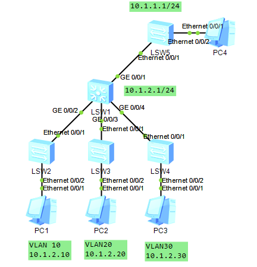

## 前情提要

在进行VLAN划分的时候，有些时候使用子网掩码为28位的IP，例如192.168.1.1/28，这里要减去一个路由IP、子网IP和广播IP，就只有13位IP可用，利用率就只有13/16=81.25%，在多次使用小掩码（掩码大于24的时候）便会浪费过多IP，因此引入SuperVLAN用于解决这个问题

## 实验拓扑



## 配置代码

在LSW1上创建VLAN10、20、30、40和100，其中VLAN100是 `Super-VLAN`，VLAN10、20和30是 `Sub-VLAN`。VLAN40是连接LSW5的VLAN

```
vlan batch 10 20 30 40 100
```

将接口配置 `trunk`并配置通过的VLAN

```
int g0/0/2
port link-type trunk
port trunk allow-pass vlan 10 20 30 40
int g0/0/3
port link-type trunk
port trunk allow-pass vlan 10 20 30 40
int g0/0/4
port link-type trunk
port trunk allow-pass vlan 10 20 30 40
```

接着在LSW2、LSW3和LSW4上创建对应的VLAN，同时配置上联到LSW1的接口为 `trunk`，允许透过VLAN10、20、30、40，下联对应的VLAN的 `access`接口

```
int e0/0/1
port link-type trunk
port trunk allow-pass vlan 10 20 30 40
int e0/0/2
port link-type access
port default vlan 10
```

同理配置LSW2和LSW3

### LSW5

按照下面的代码配置VLAN和接口模式即可

```
vlan batch 40
int e0/0/1
port link-type trunk
port trunk allow-pass vlan all
int e0/0/2
port link-type access
port default vlan 40
```

### 创建Super-VLAN

```
vlan 100
aggregate-vlan
access-vlan 10 20 30
int vlanif 100
ip add 10.1.2.254 24
int vlanif 40
ip add 10.1.1.254 24
```

此时就完成了VLAN10、20、30之间的隔离，但是可以访问VLAN40

### 配置互访

要让Sub-VLAN互访，我们需要配置代理arp

```
int vlanif 100
arp-proxy inter-sub-vlan-proxy enable
```

配置完成之后就能做到Sub-VLAN间互访
