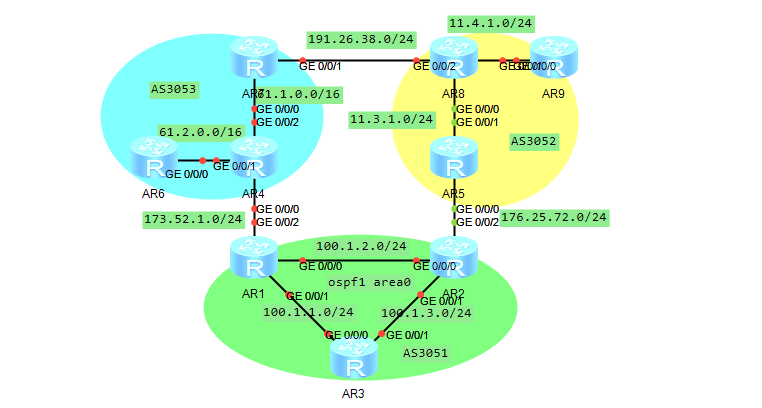

## 实验拓扑



## 配置代码

配置BGP区域AS3051-AS3053

### AS3051

根据拓扑，将AR1和AR2配置为BGP出口路由，首先配置子网地址和路由协议

#### AR1

```
undo t t
sys
int g0/0/0
ip add 100.1.2.1 24
int g0/0/1
ip add 100.1.1.1 24
int g0/0/2
ip add 173.52.1.1 24
ospf 1
area 0
network 100.1.2.0 0.0.0.255
network 100.1.1.0 0.0.0.255
```

#### AR2

```
undo t t
sys
int g0/0/0
ip add 100.1.2.2 24
int g0/0/1
ip add 100.1.3.2 24
int g0/0/2
ip add 176.25.72.2 24
ospf 1
area 0
network 100.1.2.0 0.0.0.255
network 100.1.3.0 0.0.0.255
```

#### AR3

```
undo t t
sys
int g0/0/0
ip add 100.1.1.3 24
int g0/0/1
ip add 100.1.3.3 24
ospf 1
area 0
network 100.1.1.0 0.0.0.255
network 100.1.3.0 0.0.0.255
```

在配置完成路由条目之后，选择配置区域路由BGP条目

#### AR1

```
bgp 3051
peer 100.1.1.3 as-number 3051
peer 100.1.2.2 as-number 3051
peer 173.52.1.4 as-number 3053
import-route direct
import-route ospf 1
```

#### AR2

```
bgp 3051
peer 100.1.2.1 as-number 3051
peer 100.1.3.3 as-number 3051
peer 176.25.72.5 as-number 3052
import-route direct
import-route ospf 1
```

#### AR3

```
bgp 3051
peer 100.1.1.1 as-number 3051
peer 100.1.3.2 as-number 3051
```

> AR1和AR2是边界路由器，因此需要将直连路由(Direct)和OSPF路由(OSPF)引入到BGP中，但是AR3只需要配置BGP邻居即可

同理配置AS3052和AS3053
