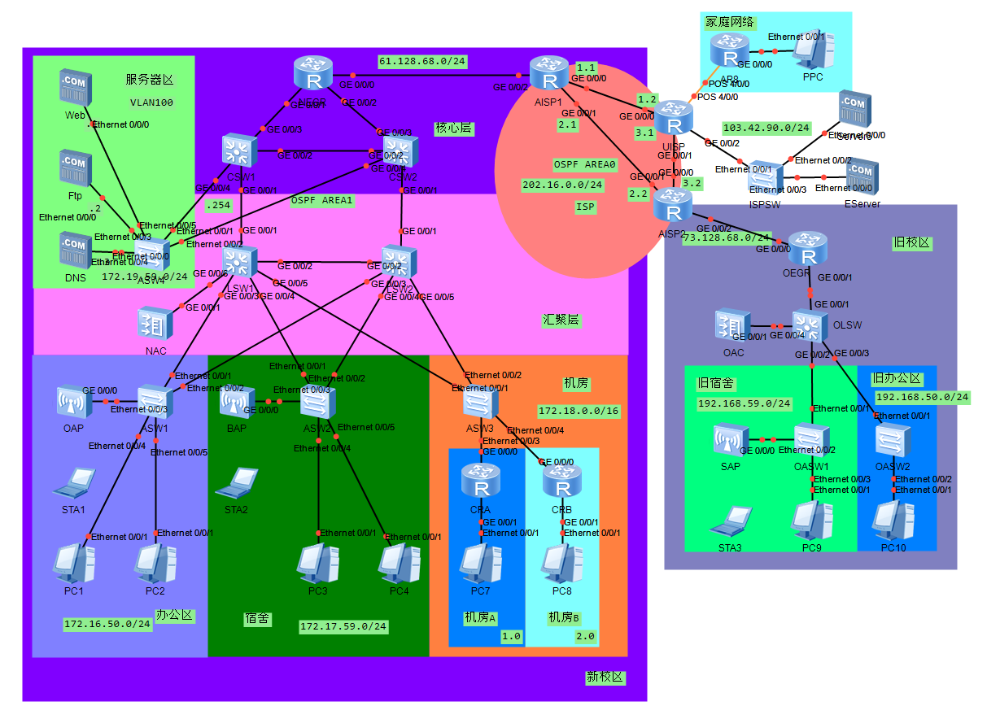

## 物理拓扑



## IP规划

### 新校区

| 区域         | 网段           | VLAN |
| ------------ | -------------- | ---- |
| 办公区（新） | 172.16.50.0/24 | 10   |
| 宿舍（新）   | 172.17.59.0/24 | 20   |
| 机房         | 172.18.0.0/16  | 30   |
| 服务器       | 172.19.50.0/24 | 100  |
| AC管理（新） | 172.19.59.0/24 | 66   |
| AC业务（新） | 172.20.0.0/16  | 80   |

### 旧校区

| 区域           | 网段            | VLAN |
| -------------- | --------------- | ---- |
| AC管理（旧）   | 192.168.55.0/24 | 55   |
| AC业务（旧）   | 192.168.60.0/24 | 60   |
| 办公区（旧）   | 192.168.50.0/24 | 50   |
| 宿舍（旧）     | 192.168.59.0/24 | 59   |
| 路由->核心交换 | 192.168.88.0/24 | 88   |

其他区域

| 区域       | 网段           |
| ---------- | -------------- |
| ISP        | 202.16.0.0/24  |
| ISPS       | 103.42.90.0/24 |
| 新校区接入 | 61.128.68.0/24 |
| 旧校区接入 | 73.128.68.0/24 |

## 需求

使用新校区使用OSPF实现动态路由

新校区和旧校区之间使用IPSec实现互访

## 部署

### 旧校区

#### 办公室和宿舍VLAN

配置办公室和宿舍的VLAN，使其能够区域间互访

##### OLSW

```
vlan batch 50 59
int g0/0/1
port link-type trunk
port trunk allow-pass vlan all
int g0/0/2
port link-type trunk
port trunk allow-pass vlan all
int vlanif 50
ip add 192.168.50.254 24
int vlanif 59
ip add 192.168.59.254 24
```

##### OASW1

```
vlan batch 50 59
int e0/0/1
port link-type trunk
port trunk allow-pass vlan all
int e0/0/3
port link-type access
port default vlan 59
```

##### OASW2

```
vlan batch 50 59
int e0/0/1
port link-type trunk
port trunk allow-pass vlan all
int e0/0/2
port link-type access
port default vlan 50
```

#### OEGR->OLSW和OSPF

配置路由器OEGR到OLSW之间的路由以及OSPF区域

##### OEGR

```
int g0/0/1
ip add 192.168.88.254 24
ospf 1
area 2
network 192.168.88.0 0.0.0.255
```

##### OLSW

```
vlan 88
int g0/0/1
port link-type access
port default vlan 88
int vlanif 88
ip add 192.168.88.1 24
ospf 1
area 2
network 192.168.88.0 0.0.0.255
network 192.168.50.0 0.0.0.255
network 192.168.59.0 0.0.0.255
```

#### WLAN

配置VLAN55为管理VLAN，VLAN60为业务VLAN

OLSW作为设备的DHCP，OAC作为AP设备的DHCP

##### OLSW

```
vlan batch 55 60
int vlanif 60
ip add 192.168.60.254 24
int g0/0/4
port link-type trunk
port trunk allow-pass vlan all

dhcp enable
ip pool OWLAN
network 192.168.60.0 mask 24
gateway-list 192.168.60.254
int vlanif 60
dhcp select global

ospf 1
area 2
network 192.168.60.0 0.0.0.255
```

##### OAC

```
vlan batch 55 60
int vlanif 55
ip add 192.168.55.254 24
int g0/0/1
port link-type trunk
port trunk allow-pass vlan all
quit

dhcp enable
ip pool OAP
network 192.168.55.0 mask 24
gateway-list 192.168.55.254
int vlanif 55
dhcp select global

wlan
regulatory-domain-profile name default
country-code cn
quit
ap-group name OSchool
regulatory-domain-profile default
```

这里需要第一次输入y验证

```
return
system
capwap source int vlanif 55
wlan
ap auth-mode mac-auth
ap-id 0 ap-mac 00e0-fcba-52e0
ap-name SAP
ap-group OSchool
```

这里需要第二次输入y验证

```
return
systemm
wlan
security-profile name EDU
security wpa-wpa2 psk pass-phrase edu123456
quit
ssid-profile name EDU
ssid EDU
quit
vap-profile name EDU
forward-mode direct-forward
service-vlan vlan-id 60
security-profile EDU
ssid-profile EDU
quit
ap-group name OSchool
vap-profile EDU wlan 1 radio all
```

##### OASW1

```
vlan batch 55 60
int e0/0/2
port link-type trunk
port trunk pvid vlan 55
port trunk allow-pass vlan all
```
