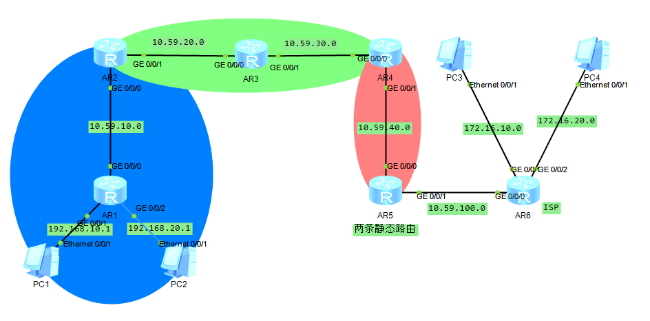
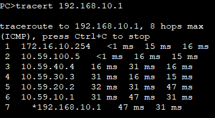

## 拓朴图



## 路由规划

| Route | GE0/0/0     | GE0/01         | GE0/0/2        |
| ----- | ----------- | -------------- | -------------- |
| AR1   | 10.59.10.1  | 192.168.10.254 | 192.168.20.254 |
| AR2   | 10.59.10.2  | 10.59.20.2     |                |
| AR3   | 10.59.20.3  | 10.59.30.3     |                |
| AR4   | 10.59.30.4  | 10.59.40.4     |                |
| AR5   | 10.59.40.5  | 10.59.100.5    |                |
| AR6   | 10.59.100.6 | 172.16.10.254  | 172.16.20.254  |

## 配置代码

代码部分省略了端口IP的配置

## [AR1]

```
ospf 1 router-id 1.1.1.1
area 1
network 192.168.10.0 0.0.0.255
network 192.168.20.0 0.0.0.255
network 10.59.10.0 0.0.0.255
stub
```

### [AR2]

由于AR2为area1的边缘路由，因此在此做路由汇聚

```
ospf 1 router-id 2.2.2.2
area 1
network 10.59.10.0 0.0.0.255
abr-summary 192.168.0.0 255.255.224.0
stub
q
area 0
network 10.59.20.0 0.0.0.255
```

### [AR3]

```
ospf 1 router-id 3.3.3.3
area 0
network 10.59.20.0 0.0.0.255
network 10.59.30.0 0.0.0.255
```

### [AR4]

```
ospf 1 router-id 4.4.4.4
area 0
network 10.59.30.0 0.0.0.255
q
area 2
network 10.59.40.0 0.0.0.255
```

### [AR5]

```
ip route-static 172.16.0.0 255.255.224.0 10.59.100.6
ospf 1 route-id 5.5.5.5
area 2
network 10.59.40.0 0.0.0.255
q
import-route static
```

### [AR6]

```
ip route-static 0.0.0.0 0 10.59.100.5
```

## 验证

PC3->PC1


