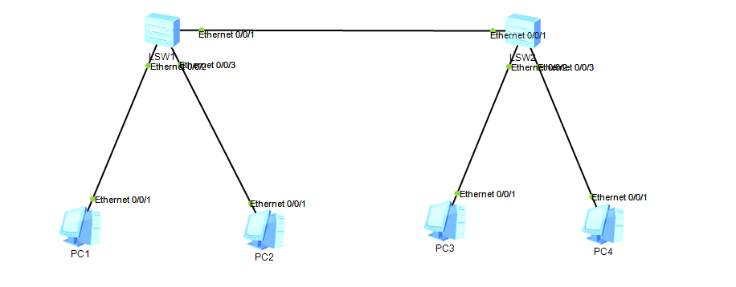

## 拓朴图



## 配置代码

### LSW1

```
vlan batch 10 20
int e0/0/1
port link-type trunk
port trunk pvid vlan 1
port trunk allow-pass vlan all
int e0/0/2
port link-type access
port default vlan 10
int e0/0/3
port link-tpye access
port default vlan 20
```

### LSW2

```
vlan batch 10 20
int e0/0/1
port link-type trunk
port trunk pvid vlan 1
port trunk allow-pass vlan all
int e0/0/2
port link-type access
port default vlan 10
int e0/0/3
port link-tpye access
port default vlan 20
```

## 连通性

Vlan10之间，Vlan20之间可以ping通，不同Vlan之间不能访问
