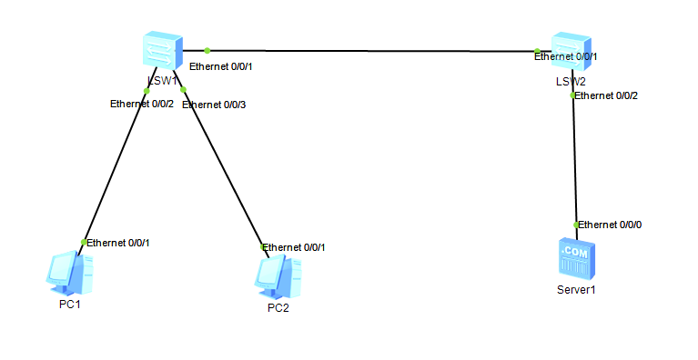

## Access+Trunk模式

### 拓朴图


### 配置代码

#### LSW1

```
vlan batch 10 20
int e0/0/1
port link-type trunk
port trunk pvid vlan 1
port trunk allow-pass vlan all
int e0/0/2
port link-type access
port default vlan 10
int e0/0/3
port link-tpye access
port default vlan 20
```

#### LSW2

```
vlan batch 10 20
int e0/0/1
port link-type trunk
port trunk pvid vlan 1
port trunk allow-pass vlan all
int e0/0/2
port link-type access
port default vlan 10
int e0/0/3
port link-tpye access
port default vlan 20
```

### 连通性

VLAN10之间，VLAN20之间可以ping通，不同VLAN之间不能访问

## Hybrid模式

### 拓扑图



### 配置代码

#### LSW1

```
vlan batch 10 20 100
int e0/0/1
port link-type hybrid
port hybrid tagged vlan all
int e0/0/2
port link-type hybrid
port hybrid pvid vlan 10
port hybrid untagged vlan 10 100
int e0/0/3
port link-type hybrid
port hybrid pvid vlan 20
port hybrid untagged vlan 20 100
```

#### LSW2

```
vlan batch 10 20 100
int e0/0/1
port link-type hybrid
port hybrid tagged vlan all
int e0/0/2
port link-type hybrid
port hybrid pvid vlan 100
port hybrid untagged vlan 10 20 100
```

### 连通性

此时VLAN10和VLAN20不能相互通讯，但是都可以访问VLAN100
