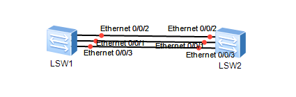
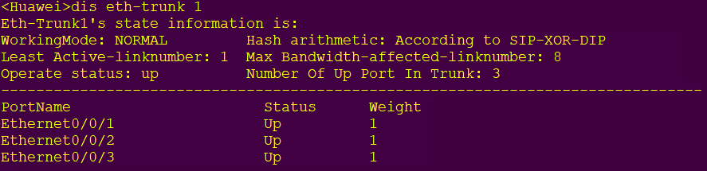
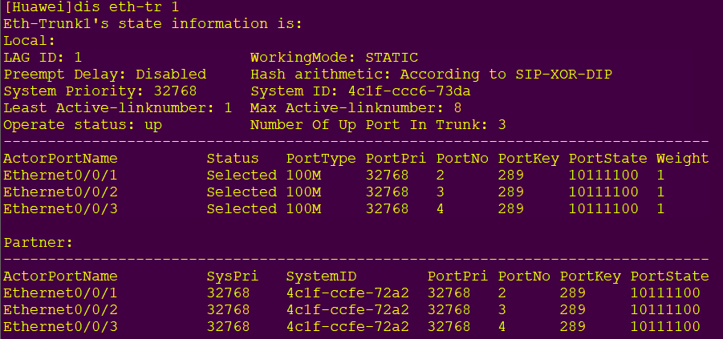
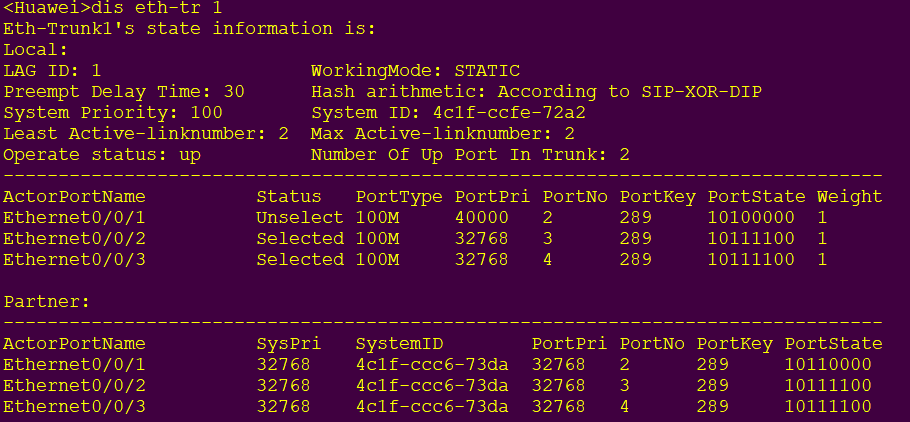
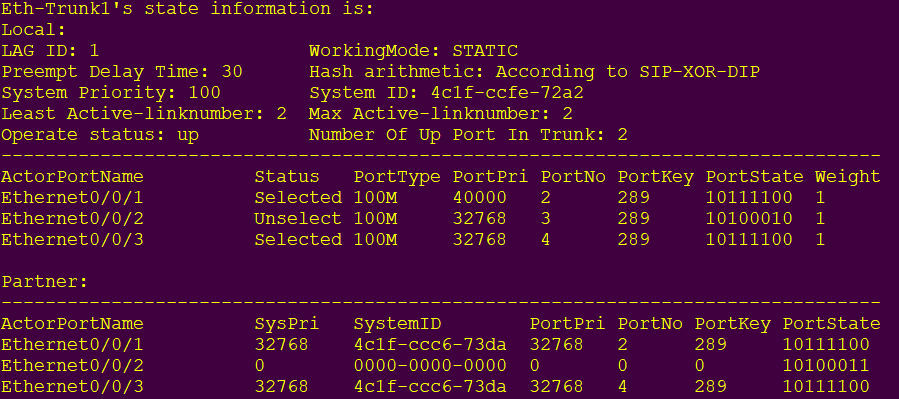
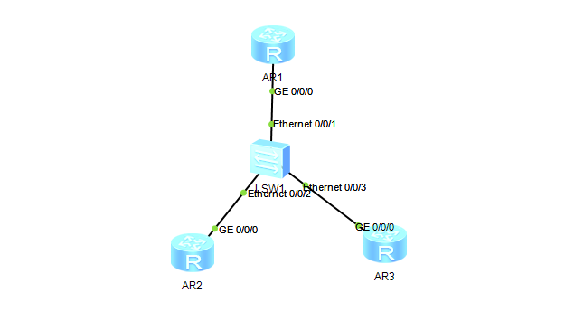

# 链路聚合

## 拓扑图



## 配置代码

### [LSW1]

```bash
int eth-tr 1
mode manual load-balance
q
int e0/0/1
eth-tr 1
```

这里只配置了E0/0/1接口，自行将E0/0/2和E0/0/3接口如代码行5、6配置即可

LSW2和LSW1代码一致，保证绑定接口一致即可

### 验证配置

```bash
dis eth-tr 1
```



## 配置LACP

拓扑图和常规配置相同，但是要删除之前创建的eth-trunk

### 配置代码

[LSW1]

```bash
int eth-tr 1
mode lcap
trunkport eth 0/0/1 to 0/0/3
```

LSW2和LSW1代码一致，保证绑定接口一致即可

### 验证配置



### 配置主备接口

首先就是要配置LSW1使其成为主动端设备

```
lacp pri 100
```

配置端口优先级，让E0/0/1处于备份接口，E0/0/2和E0/0/3为主接口

```
int e0/0/1
lacp pri 40000
```

端口默认优先级为32768，越小优先级越高

### 配置活动接口阈值

我们让接口少于2的时候直接关闭eth-tr接口，同时配置抢占功能，当活动链路出现故障的时候能够自动替换

```bash
int eth-tr 1
max active 2
least active 2
lacp pre enable
```

### 验证配置



### 模拟故障

手动关闭E0/0/2接口模拟链路故障

```
int e0/0/2
shutdown
```



# 实现VLAN间通讯

## 拓扑图



## IP规划

|     | GE0/0/0     | GE0/0/0.2     | GE0/0/0.3     |
| --- | ----------- | ------------- | ------------- |
| AR1 |             | 192.168.2.254 | 192.168.3.254 |
| AR2 | 192.168.2.1 |               |               |
| AR3 | 192.168.3.1 |               |               |

## 配置代码

在AR2上配置接口IP和静态路由（相当于默认网关）

```bash
ip route-static 0.0.0.0 0 192.168.2.254
```

同理配置AR3[AR1]

### [LSW1]

在LSW1上对AR2和AR3进行VLAN划分

```
vlan batch 2 3
int e0/0/2
port link-type access
port default vlan 2
int e0/0/3
port link-type access
port default vlan 3
int e0/0/1
port link-type trunk
port trunk allow-pass vlan all
```

使用Dot1Q配置子接口

```
int g0/0/0.2
dot1q ter vid 2
arp broad enable
ip add 192.168.2.254 24
int g0/0/0.3
dot1q ter vid 3
arp broad enable
ip add 192.168.3.254 24
```

配置完成之后便可以实现VLAN间互访

## 使用交换机实现VLAN间互访

```
int vlanif 2
ip add 192.168.2.254 24
int vlanif 3
ip add 192.168.3.254 24
```

这两个方法实现的效果是一样的
