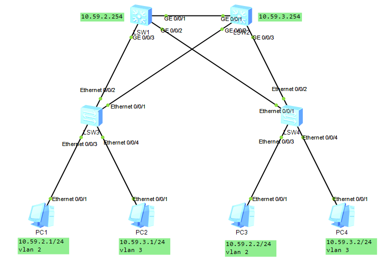

## 拓扑图



## 更多知识

下列代码能够关闭设备的bash输出

```
undo terminal trapping
```

## 配置代码

### 基础配置

#### [LSW1]

```
vlan batch 2 3
int g0/0/1
vlan link-type trunk
vlan trunk allow-pass vlan all
int g0/0/2
vlan link-type trunk
vlan trunk allow-pass vlan all
int g0/0/3
vlan link-type trunk
vlan trunk allow-pass vlan all
int vlanif 2
ip add 10.59.2.254 24
q
stp enable
stp mode mstp
stp region-configuration
region-name m1ishu
revision-level 1
instance 1 vlan 2
instance 2 vlan 3
active region-configuration
q
stp instance 1 pri 4096
```

#### [LSW2]

```
vlan batch 2 3
int g0/0/1
vlan link-type trunk
vlan trunk allow-pass vlan all
int g0/0/2
vlan link-type trunk
vlan trunk allow-pass vlan all
int g0/0/3
vlan link-type trunk
vlan trunk allow-pass vlan all
int vlanif 3
ip add 10.59.3.254 24
q
stp enable
stp mode mstp
stp region-configuration
region-name m1ishu
revision-level 1
instance 1 vlan 2
instance 2 vlan 3
active region-configuration
q
stp instance 1 pri 4096
```

#### [LSW3]

```
vlan batch 2 3
int e0/0/3
port link-type access
port default vlan 2
int e0/0/4
port link-type access
port default vlan 3
int e0/0/1
port link-type trunk
port trunk allow-pass vlan all
int e0/0/2
port link-type trunk
port trunk allow-pass vlan all
q
stp enable
stp mode mstp
stp region-configuration
region-name m1ishu
revision-level 1
instance 1 vlan 2
instance 2 vlan 3
active region-configuration
```

#### [LSW4]

```
vlan batch 2 3
int e0/0/3
port link-type access
port default vlan 2
int e0/0/4
port link-type access
port default vlan 3
int e0/0/1
port link-type trunk
port trunk allow-pass vlan all
int e0/0/2
port link-type trunk
port trunk allow-pass vlan all
q
stp enable
stp mode mstp
stp region-configuration
region-name m1ishu
revision-level 1
instance 1 vlan 2
instance 2 vlan 3
active region-configuration
```

### 配置VLAN间互通

#### [LSW1]

```
int vlanif 3
ip add 10.59.3.253 24
```

#### [LSW2]

```
int vlanif 2
ip add 10.59.2.254 24
```
