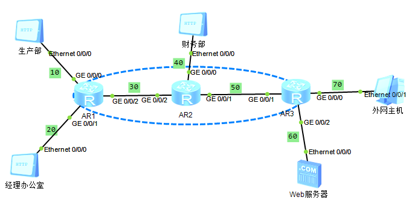

## 实验拓扑



## IP规划

|       | AR1          | AR2          | AR3          | 生产部     | 财务部     | 经理办公室 | Web服务器  | 外网主机   |
| ----- | ------------ | ------------ | ------------ | ---------- | ---------- | ---------- | ---------- | ---------- |
| 0/0/0 | 10.59.10.254 | 10.59.40.254 | 10.59.70.254 | 10.59.10.1 | 10.59.40.1 | 10.59.20.1 | 10.59.60.1 | 10.59.70.1 |
| 0/0/1 | 10.59.20.254 | 10.59.50.1   | 10.59.50.2   |            |            |            |            |            |
| 0/0/2 | 10.59.30.1   | 10.59.30.2   | 10.59.60.254 |            |            |            |            |            |

## 需求

1、配置OSPF实现公司内网环境互通，注入外网主机直连路由，实现全拓扑互通
2、生产部和经理办公室可访问公司WEB服务器，财务部不能访问WEB服务器
3、财务部只能经理办公室互访，其他部门禁止访问
4、财务部不能访问外网，生产部禁止周一到周五工作时间访问外网，经理办公室不限制外网访问

## 路由配置

[AR1]

```
ospf 1
area 0
network 10.59.10.0 0.0.0.255
network 10.59.20.0 0.0.0.255
network 10.59.30.0 0.0.0.255
```

[AR2]

```
ospf 1
area 0
network 10.59.30.0 0.0.0.255
network 10.59.40.0 0.0.0.255
network 10.59.50.0 0.0.0.255
```

[AR3]

```
ospf 1
area 0
network 10.59.50.0 0.0.0.255
network 10.59.60.0 0.0.0.255
network 10.59.70.0 0.0.0.255
```

由于这里外网主机与内网只有一条路由，因此直接使用OSPF引入路由，在其他环境中，可选择使用默认静态路由或引入路由

## ACL

2.生产部和经理办公室可访问公司WEB服务器，财务部不能访问WEB服务器

在AR3上配置GE0/0/2的出口限制

```
acl 2000
rule 5 permit source 10.59.10.0 0.0.0.255
rule 5 permit source 10.59.20.0 0.0.0.255
rule 10 deny source 10.59.40.0 0.0.0.255
rule 20 permit source any
```

在接口应用ACL

```
int g0/0/2
traffic-filter outbound acl 2000
```

3.财务部只能经理办公室互访，其他部门禁止访问

由于要实现互访，可以使用VLAN环境配置

或者在AR2中配置

```
acl 2001
rule 5 permit source 10.59.20.0 0.0.0.255
rule 10 deny source any
```

这里和4中的需求合在一起完成 `财务部不能访问外网`

```
int g0/0/0
traffic-filter outbound acl 2001
```

4.财务部不能访问外网，生产部禁止周一到周五工作时间访问外网，经理办公室不限制外网访问

由于 `财务部不能访问外网`在AR2中已经实现，因此只需要完成后面的两个操作

```
time-range limit-time 00:00 to 23:59 working-day
acl 2002
rule 5 permit source 10.59.20.0 0.0.0.255
rule 10 permit source 10.59.10.0 0.0.0.255 time-range limit-time
```

在AR3中配置

```
int g0/0/1
traffic-filter inbound acl 2002
```
