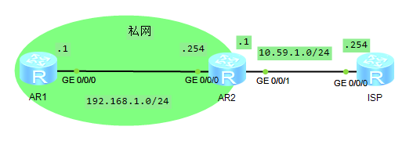

## 实验拓扑



## IP规划

|        | AR1         | AR2           | ISP         |
| ------ | ----------- | ------------- | ----------- |
| G0/0/0 | 192.168.1.1 | 192.168.1.254 |             |
| G0/0/1 |             | 10.59.1.1     | 10.59.1.254 |

## 配置Telnet登录

在AR1和ISP上配置Telnet

```
user-interface vty 0 4
authentication-mode aaa
quit
aaa
local-user mlishu password cipher lishu
local-user mlishu service-type telnet
local-user mlishu privilege level 15
```

这是标准的Bash方式配置Telnet登录账户

## NAT池配置

### 配置静态路由

AR1->AR2

配置AR1指向AR2的静态路由作为默认网关

```
ip route-static 0.0.0.0 0 192.168.1.254
```

AR2->ISP

配置AR2指向ISP的默认路由作为边缘路由

```
ip route-static 0.0.0.0 0 10.59.1.254
```

### 配置NAT池

```
nat address-group 1 10.59.1.10 10.59.1.20
acl 2000
rule 5 permit source any
int g0/0/1
nat outbound 2000 address-group 1
```

## 验证配置

在AR1上使用telnet登录ISP

在AR2上显示NAT转换，如ICMP `<AR2>`dis nat session all

ICMP检测


## 配置NAT Server

此时我们只做到了内网设备使用NAT，但是外网设备无法访问内网设备，因此引入NAT Server

```
nat server protocol tcp global current-interface 8023 inside 192.168.1.1 telnet
```

现在外网主机就可以通过访问10.59.1.1的方式访问内网192.168.1.1的主机

```
<AR2>dis nat session all 
  NAT Session Table Information:

     Protocol          : TCP(6)
     SrcAddr  Port Vpn : 10.59.1.254     29380                          
     DestAddr Port Vpn : 10.59.1.1       22303                          
     NAT-Info
       New SrcAddr     : ----
       New SrcPort     : ----
       New DestAddr    : 192.168.1.1  
       New DestPort    : 5888 

  Total : 1
```
