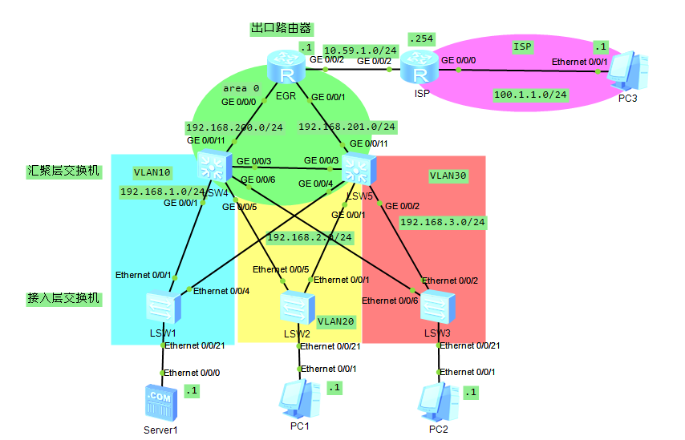

## 实验拓扑



## IP规划

|        | EGR             | ISP         |  |
| ------ | --------------- | ----------- | - |
| G0/0/0 | 192.168.200.254 | 100.1.1.254 |  |
| G0/0/1 | 192.168.201.254 |             |  |
| G0/0/2 | 10.59.1.1       | 10.59.1.254 |  |

## MSTP配置

```
vlan batch 10 20 30
stp mode mstp
stp region-configuration
region-name mlishu
instance 1 vlan 10
instance 2 vlan 20
instance 3 vlan 30
active region-configuration
```

### 根桥配置

核心交换机1作为VLAN 10的根桥，核心交换机2作为VLAN 20/30的根桥

#### 核心交换机1

```
stp instance 1 root primary
stp instance 2 root secondary
stp instance 3 root secondary
```

#### 核心交换机2

```
stp instance 1 root secondary
stp instance 2 root primary
stp instance 3 root primary
```

### 链路配置

#### 核心交换机1

```
int g0/0/1
port link-type trunk
port trunk allow-pass vlan all
int g0/0/3
port link-type trunk
port trunk allow-pass vlan all
int g0/0/5
port link-type trunk
port trunk allow-pass vlan all
int g0/0/6
port link-type trunk
port trunk allow-pass vlan all
```

#### 核心交换机2

```
int g0/0/1
port link-type trunk
port trunk allow-pass vlan all
int g0/0/2
port link-type trunk
port trunk allow-pass vlan all
int g0/0/3
port link-type trunk
port trunk allow-pass vlan all
int g0/0/4
port link-type trunk
port trunk allow-pass vlan all
```

#### 接入交换机1

```
int e0/0/1
port link-type trunk
port trunk allow-pass vlan all
int e0/0/4
port link-type trunk
port trunk allow-pass vlan all
int e0/0/21
port link-type access
port default vlan 10
```

#### 接入交换机2

```
int e0/0/1
port link-type trunk
port trunk allow-pass vlan all
int e0/0/5
port link-type trunk
port trunk allow-pass vlan all
int e0/0/21
port link-type access
port default vlan 20
```

#### 接入交换机3

```
int e0/0/2
port link-type trunk
port trunk allow-pass vlan all
int e0/0/6
port link-type trunk
port trunk allow-pass vlan all
int e0/0/21
port link-type access
port default vlan 30
```

### 三层接口配置

#### 核心交换机1

```
int vlanif 10
ip add 192.168.1.254 24
int vlanif 20
ip add 192.168.2.253 24
int vlanif 30
ip add 192.168.3.253 24
```

#### 核心交换机2

```
int vlanif 10
ip add 192.168.1.253 24
int vlanif 20
ip add 192.168.2.254 24
int vlanif 30
ip add 192.168.3.254 24
```

配置到这里就完成了交换部分的配置

## OSPF配置

### EGR

```
int g0/0/0
ip add 192.168.200.254 24
int g0/0/1
ip add 192.168.201.254 24
ospf 1
area 0
network 192.168.200.0 0.0.0.255
network 192.168.201.0 0.0.0.255
```

### 核心交换机1

```
int vlanif 40
ip add 192.168.200.1 24
int g0/0/11
port link-type access
port default vlan 40
q
ospf 1
area 0
network 192.168.200.0 0.0.0.255
network 192.168.1.0 0.0.0.255
network 192.168.2.0 0.0.0.255
network 192.168.3.0 0.0.0.255
```

### 核心交换机2

```
int vlanif 50
ip add 192.168.201.1 24
int g0/0/11
port link-type access
port default vlan 50
q
ospf 1
area 0
network 192.168.201.0 0.0.0.255
network 192.168.1.0 0.0.0.255
network 192.168.2.0 0.0.0.255
network 192.168.3.0 0.0.0.255
```

## Nat配置

```
nat address-group 1 10.59.1.10 10.59.1.20
acl 2000
rule permit source 192.168.2.0 0.0.0.255
rule permit source 192.168.3.0 0.0.0.255
q
int g0/0/2
nat outbound 2000 address-group 1
```
