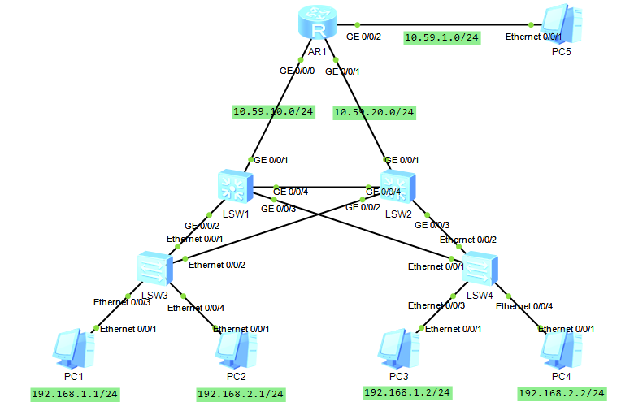

## 实验拓扑



## MSTP区域配置

```
vlan batch 10 20
stp mode mstp
stp region-configuration
region-name mlishu
instance 1 vlan 10
instance 2 vlan 20
active region-configuration
```

### 根桥配置

LSW1作为VLAN 10的根桥，LSW2作为VLAN 20的根桥

#### LSW1

```
stp instance 1 root primary
stp instance 2 root secondary
```

#### LSW2

```
stp instance 1 root secondary
stp instance 2 root primary
```

### 接口配置

#### LSW1

```
int g0/0/2
port link-type trunk
port trunk allow-pass vlan all
int g0/0/3
port link-type trunk
port trunk allow-pass vlan all
int g0/0/4
port link-type trunk
port trunk allow-pass vlan all
```

#### LSW2

```
int g0/0/2
port link-type trunk
port trunk allow-pass vlan all
int g0/0/3
port link-type trunk
port trunk allow-pass vlan all
int g0/0/4
port link-type trunk
port trunk allow-pass vlan all
```

#### LSW3

```
int e0/0/1
port link-type trunk
port trunk allow-pass vlan all
int e0/0/2
port link-type trunk
port trunk allow-pass vlan all
int e0/0/3
port link-type access
port default vlan 10
int e0/0/4
port link-type access
port default vlan 20
```

#### LSW4

```
int e0/0/1
port link-type trunk
port trunk allow-pass vlan all
int e0/0/2
port link-type trunk
port trunk allow-pass vlan all
int e0/0/3
port link-type access
port default vlan 10
int e0/0/4
port link-type access
port default vlan 20
```

到这里位置做到了同VLAN间访问，加上下面可以做到跨VLAN访问

### VLAN间互访

#### LSW1

```
int vlanif 10
ip add 192.168.1.254 24
int vlanif 20
ip add 192.168.2.253 24
```

#### LSW2

```
int vlanif 10
ip add 192.168.1.253 24
int vlanif 20
ip add 192.168.2.254 24
```

## VRRP

将LSW1作主设备，LSW2作备份设备

### LSW1

```
# VLANIF10
interface Vlanif10
vrrp vrid 10 virtual-ip 192.168.1.250
vrrp vrid 10 priority 120
vrrp vrid 10 preempt-mode timer delay 20

# VLANIF20
interface Vlanif20
vrrp vrid 20 virtual-ip 192.168.2.250
vrrp vrid 20 priority 120
vrrp vrid 20 preempt-mode timer delay 20
```

### LSW2

```
# VLANIF10
interface Vlanif10
vrrp vrid 10 virtual-ip 192.168.1.250
vrrp vrid 10 priority 100
vrrp vrid 10 preempt-mode timer delay 20

# VLANIF20
interface Vlanif20
vrrp vrid 20 virtual-ip 192.168.2.250
vrrp vrid 20 priority 100
vrrp vrid 20 preempt-mode timer delay 20
```

然后将PC的网关修改为192.168.1.250和192.168.2.250

## OSPF

### AR1

```
int g0/0/0
ip add 10.59.10.1 24
int g0/0/1
ip add 10.59.20.1 24
int g0/0/2
ip add 10.59.1.254 24
q
ospf 1
area 0
network 10.59.1.0 0.0.0.255
network 10.59.10.0 0.0.0.255
network 10.59.20.0 0.0.0.255
```

### LSW1

```
vlan 100
int vlanif 100
ip add 10.59.10.2 24
int g0/0/1
port link-type access
port default vlan 100
q
ospf 1
area 0
network 10.59.10.0 0.0.0.255
network 192.168.1.0 0.0.0.255
network 192.168.2.0 0.0.0.255
```

### LSW2

```
vlan 200
int vlanif 200
ip add 10.59.20.2 24
int g0/0/1
port link-type access
port default vlan 200
q
ospf 1
area 0
network 10.59.20.0 0.0.0.255
network 192.168.1.0 0.0.0.255
network 192.168.2.0 0.0.0.255
```
