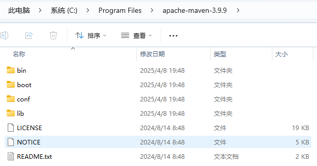

# Maven下载


# Maven配置

安装版本：`apache-maven-3.9.9-bin`

解压文件复制到希望存放的位置



创建 `maven-repo`文件夹

修改 conf 文件夹下的 settings.xml配置文件

```xml
<localRepository>
    C:\Program Files\apache-maven-3.9.9\maven-repo
</localRepository>
```

修改镜像信息 — 在 mirrors标签下添加以下内容

```xml
<!-- 阿里云仓库 -->
<mirror>
    <id>alimaven</id>
    <name>aliyun maven</name>
    <url>https://maven.aliyun.com/repository/public</url>
    <mirrorOf>central</mirrorOf>
</mirror>
<!-- 阿里云仓库2 -->
<mirror>
    <id>nexus-aliyun</id>
    <mirrorOf>*,!jeecg,!jeecg-snapshots</mirrorOf>
    <name>Nexus aliyun</name>
    <url>http://maven.aliyun.com/nexus/content/groups/public</url>
</mirror>
<!-- 中央仓库1 -->
<mirror>
    <id>repo1</id>
    <mirrorOf>central</mirrorOf>
    <name>Human Readable Name for this Mirror.</name>
    <url>https://repo1.maven.org/maven2/</url>
</mirror>
```

设置环境变量

`M2_HOME`
`MAVEN_HOME`
`%MAVEN_HOME%\bin`

```bash
// 创建变量					        值
M2_HOME					对应 maven 解压包下的 bin 目录
MAVEN_HOME				对应 maven 解压包的目录
// 在Path下创建
%MAVEN_HOME%\bin
```
