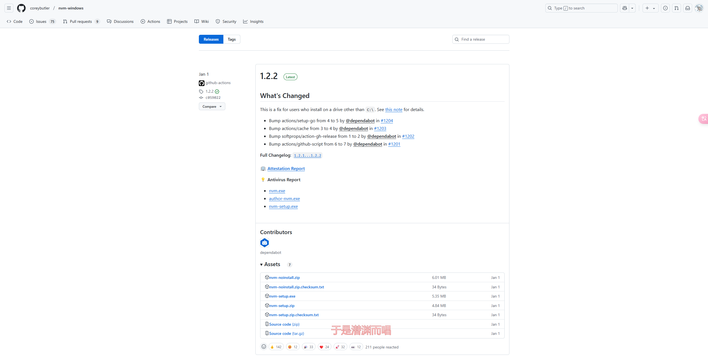
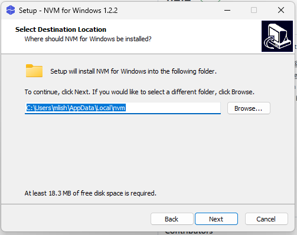
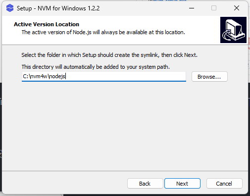
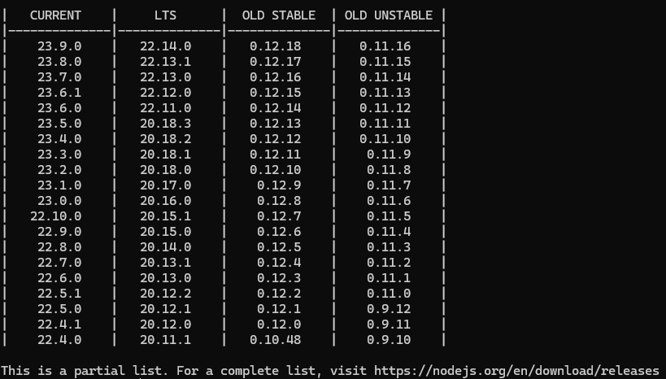
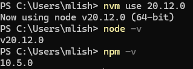
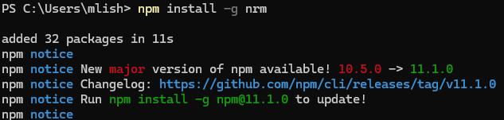
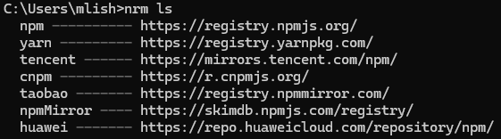

```
<!-- truncate -->
```

## 正文

在进行前端开发的时候，我们经常使用Npm包进行开发，例如：Vue框架等

之前的Node.js配置方案有些过时，现在更多使用Nvm+Nrm的Node.js管理方案

### 下载Nvm

[Nvm下载链接](https://github.com/coreybutler/nvm-windows/releases)如下图



选择nvm-setup.exe版本，由于教程编写时间与阅读时间的不一致，有可能Nvm会有更新，可以选择下载最新的版本

### 安装Nvm

在下载完成Nvm安装包之后，就可以选择安装Nvm

这里要求配置Nvm安装位置



这里与上面的Nvm位置不同



### 安装Node.js

#### 换源

由于Nvm的初始镜像服务器位于国外，有些时候无法正常下载Node.js。因此选择换源到国内

找到Nvm的安装位置，我这里是 `C:\Users\mlish\AppData\Local\nvm`这个位置是在上一步中配置的

打开 `settings.txt`文件，在文件最后面添加

```txt
node_mirror:https://npmmirror.com/mirrors/node/ 
npm_mirror:https://npmmirror.com/mirrors/npm/
```

这样就是国内的镜像了

#### 安装

在Powershell中输入

```
nvm list available
```

可以查看可用的Node.js



这里我选择安装LTS版本中的20.12.0

输入

```powershell
nvm install 20.12.0
```

就会自动安装Node.js

### 使用Node.js镜像

输入

```powershell
nvm use 20.12.0
```



这样就可以使用Node.js了

### 安装Nrm

Nrm是Node.js镜像管理工具，用于管理Npm镜像源

输入

```powershell
npm install -g nrm
```



这样就完成了nrm的安装

### 使用Nrm换源

在CMD中输入

```powershell
nrm ls
```

用于查询可用的Npm镜像



这里我选择使用npmMirror的镜像

输入

```powershell
nrm use npmMirror
```

完成镜像更新
