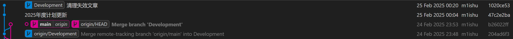
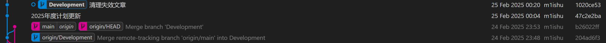

<!-- truncate -->

## 前言

在进行云笔记记录的时候，如果每次开发了笔记都直接发布到Git仓库的话，会导致自动部署服务器出现压力过大的情况，因此引入了 `Development`分支。这样可以减轻服务器的压力

## 正文

按照正常流程编程笔记、博客等文章

### 切换分支

在Git Graph中切换到Development分支

这样就是在main分支

右键 `Development`选择 `Checkout Branch`切换到开发分支，如下图

这样就切换到了 `Development`分支

### 提交代码

在Git提交列表输入分支名，提交到本地Git仓库
