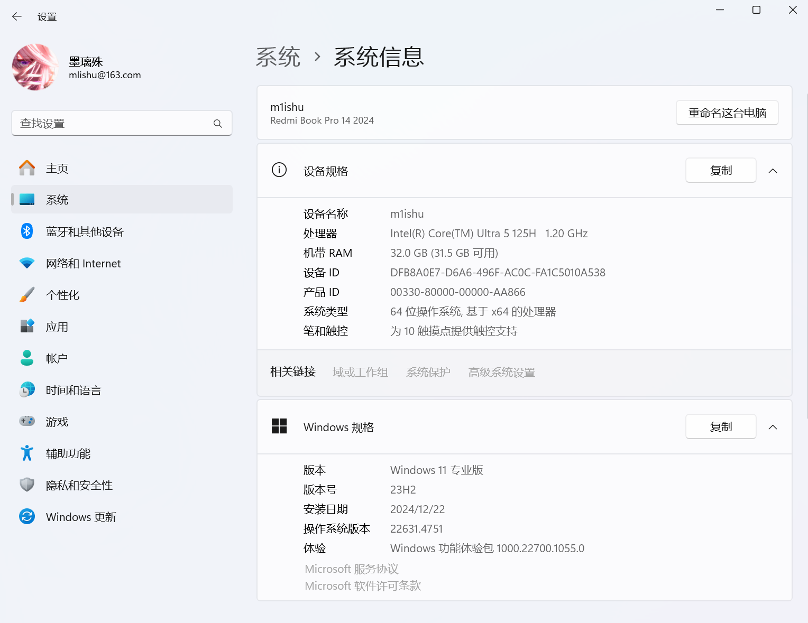
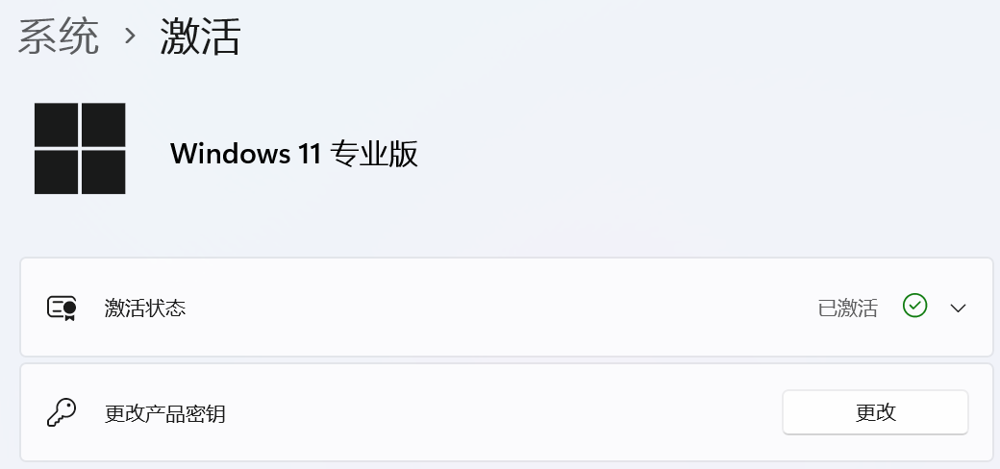
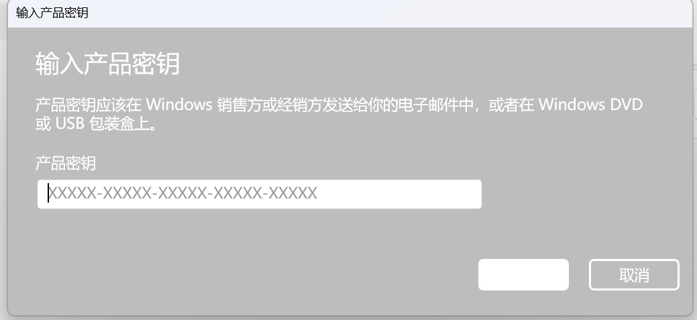
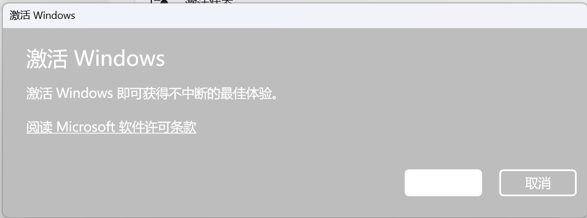
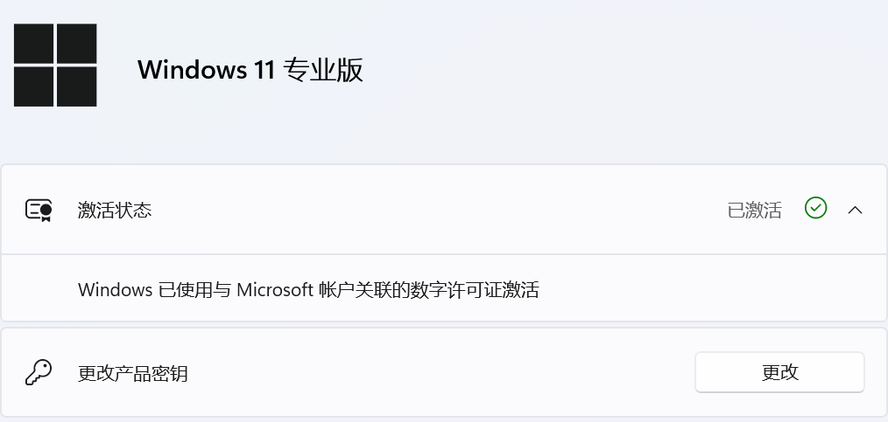
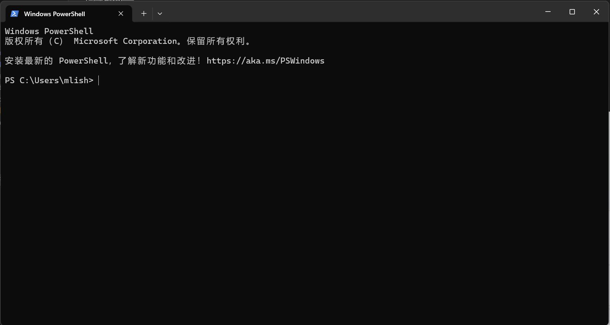
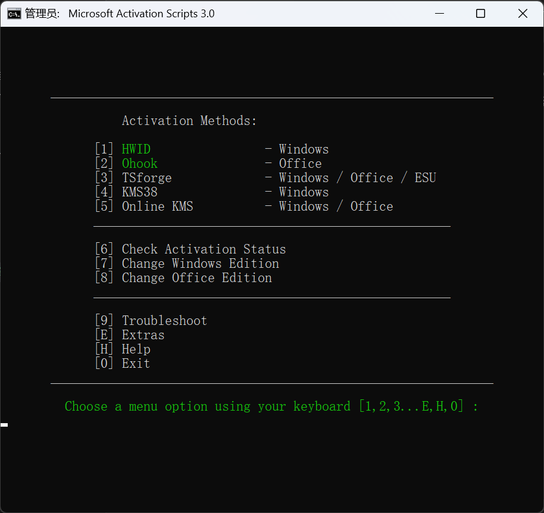
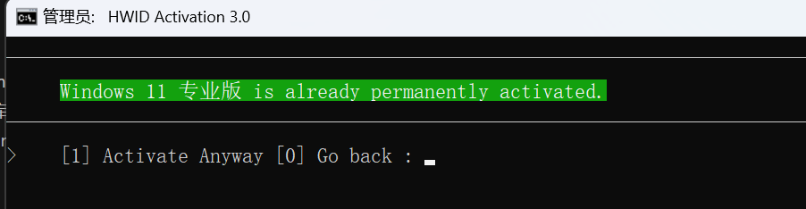

<!-- truncate -->

## 前言

在使用一些专业软件（eNSP）的时候，建议使用专业版系统，但是大部分笔记本出场安装的都是家庭版系统，本文记录了Windows11家庭版升级成专业版的流程

## 正文

### 定位到激活位置

`Win+i`进入系统设置，点击 `系统`下拉找到 `系统信息`



注：我这里是专业版系统，默认为家庭版系统即可

下拉找到 `产品密钥和激活`进入



### 更改产品密钥

如果你是品牌机（笔记本）等，而且没有更换过系统，那么使用下面的密钥

```
XWHF9-NJ9MR-7KKR3-PRWGG-WXCKG
```

反之，如果你是自己安装的系统，使用下面的密钥

```
VK7JG-NPHTM-C97JM-9MPGT-3V66T
```

一般使用上面的 `XWHF9`密钥即可

点击更改，在下面方框内输入密钥



输入之后就会进入 `激活Windows`



点击激活完成版本更换

### 激活系统

在完成版本升级之后，一般会失去激活功能，此时就需要进行系统激活

如果在完成版本更新之后显示



则不需要进行后面的操作

使用 `Win+R`输入 `powershell`，你会进入类似下图的界面



输入

```
irm massgrave.dev/get | iex
```

回车后会进入MAC3.0激活界面



按数字键1，便可以激活系统



之后退出程序即可
