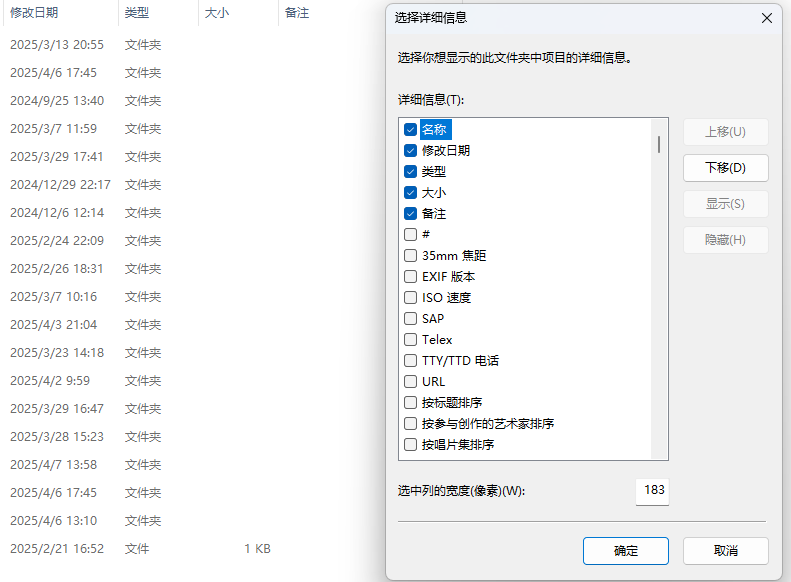
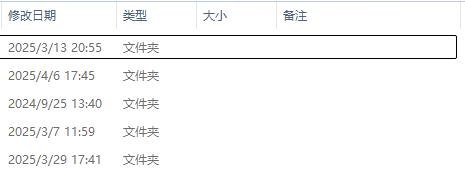
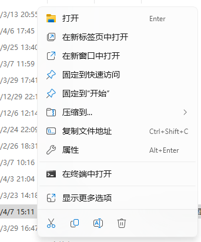
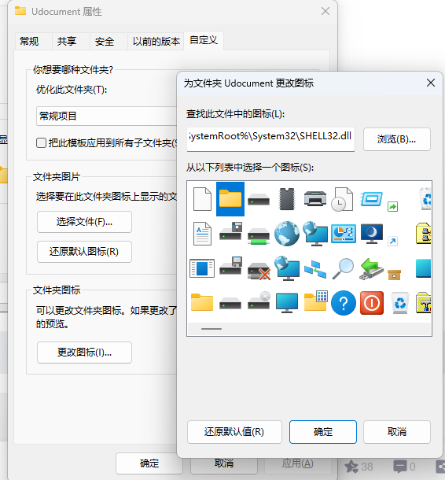
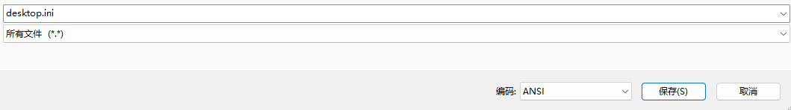

<!-- truncate -->

## 前言

由于多年前被**windows**的中文路径坑过，所以现在D盘所有文件夹都是英文，这就导致找起文件夹来特别费劲，所以想给文件夹加个备注的字段，用中文来备注

## 打开备注字段

> 进入所有需要添加备注的文件夹的父文件夹（比如我这里的这些游戏文件夹）
> **右键**红色框的任意区域，选择**其他**



这时候可以看到备注字段已经出现了



## 编辑desktop.ini

```txt
[.ShellClassInfo]
InfoTip=我是备注文本
IconResource=C:\Windows\System32\SHELL32.dll,4
[ViewState]
Mode=
Vid=
FolderType=Generic
```

理论上只需要把该desktop.ini文件放在需要备注的文件夹中就可以了，但是在实际操作过程中会遇到很多问题

### desktop.ini写好之后不显示备注

**右键**已经写好desktop.ini的文件夹，打开**属性**



点击 **自定义** ，点击**更换图标**



这时候可以看到备注已经出现，但是呈现乱码状态

### 备注乱码

这是由于desktop.ini编码不匹配导致的，回到test文件夹中查看我们先前编写的desktop.ini文件

可以看到这个.ini文件使用的是UTF-8的编码格式，我们需要ANSI编码格式的desktop.ini文件
*这个莫名其妙出现的IconResource是我们先前修改文件夹图标自动生成的*


