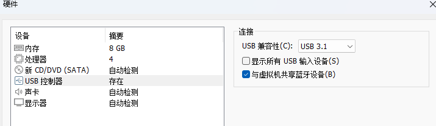
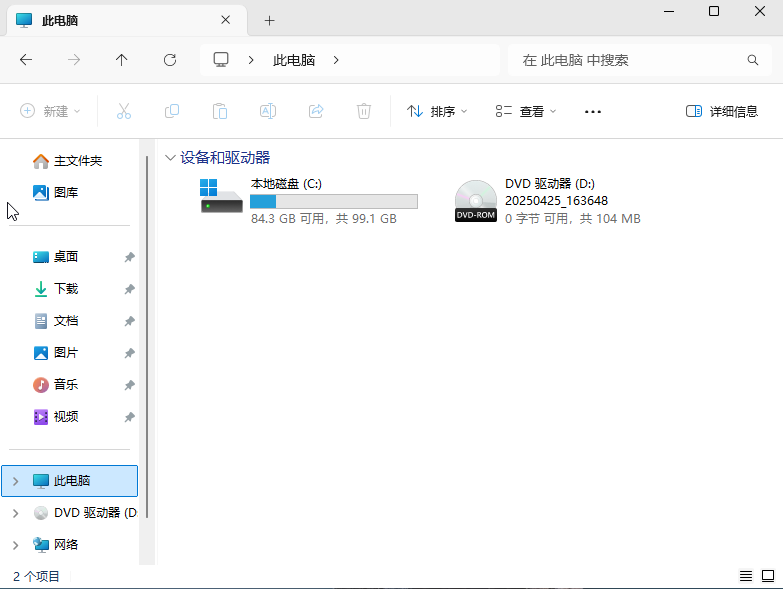

<!-- truncate -->

## 前言

由于每次在进行机房/教师电脑维护的时候，需要在安装完成系统之后安装一大堆软件，实在是过于麻烦，因此有了这篇文章

## 准备步骤

主机环境：`VMware® Workstation 17 Pro`

预安装系统版本：`Windows 11 LTSC`

封装软件：`Sysprep`

镜像构建软件：`Dism++`

镜像封装软件：`UltraISO`

## 创建主机


先不要急着选镜像


系统版本按照需要构建用的基版本


这里放到一个能够找到的位置


这里选择100G硬盘（适配机房，这个可以自由选择）

选择存储为单个文件，性能较好


这里按照主机性能适当配置性能，注意**一定要删除网卡**



## 安装系统

选中ISO镜像安装系统


按照正常Windows安装流程安装Windows即可


注意不要安装vmtools

### 构建预安装软件

在等待安装过程的过程中，先去构建预安装软件镜像

将你要安装的软件都放到一个文件夹中， 拖入 `UltraISO`


点击保存，保存到找得到的地方


此时就封装好了软件


按照正常操作进入系统


到这里为止都不需要联网，在进入桌面之后创建一个快照防止操作失误


## 安装软件

挂载刚刚创建的镜像


此时可以在Windows中看到



打开后正常激活系统（非联网）、安装软件

到这里就算完成了系统构建


## 系统封装

请删除Windows用户下的defaultuser0和其他自己创建的个人用户，使用administrator用户执行Sysprep

在CMD中输入

**net user administrator /active:yes**

切换到Administrator账户登录

删除其他账户只保留Administrator账户


如果桌面文件也需要一起封装，请在C盘下创建一个文件夹位置存放（实际测试administrator桌面的文件在sysprep后会丢失）

```
cd c:\Windows\System32\Sysprep
sysprep.exe
```


进入系统全新体验（OOBE）：准备服务，就像初次开机一样；

通用：从镜像中删除SID信息；

关机：Sysprep执行任务完毕后会立即关机


到这里就完成了Windows的封装


## 封装镜像

挂载PE镜像


注意不能打开系统，必须选择打开电源时进入固件


这里选择CDROM进入PE镜像


此时就能进入PE


进入PE后，找到需要封装的C盘（在PE中不一定是C盘，我这就是E盘）


运行Dism++，这里自动读取到了系统盘


这里选择工具箱-系统备份


这里可以自由编辑构建完成的名字


插入U盘，选择链接到虚拟机


将Win镜像保存到U盘中


这是一个很漫长的过程，等待就行

备份完成后，你会得到一个 `Wim`的文件， 这就是封装完成系统， 将它保存好， 以后可以用PE来安装它

## 构建镜像

使用UltraISO打开基系统镜像


找到sources\install.wim


将构建的Wim文件改名为install.wim

删除原本的镜像


添加新的镜像


替换成功后， 在保存的右边 找到  **另存为  为其起一个名字，选择另存保存路径之后**就可以将其以iso 的方式保存下来了


结束！！！ 你可以使用VM 去启动你封装好的这个 iso 镜像，测试是否成功
